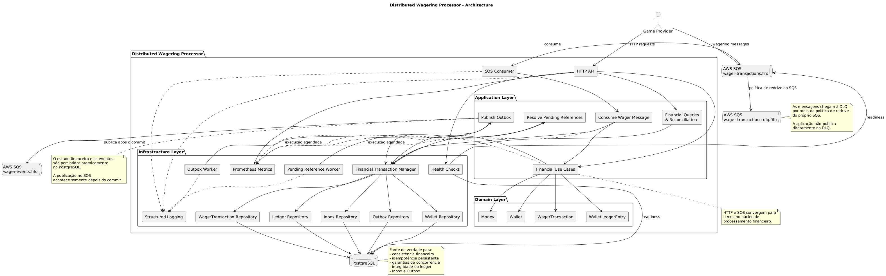

# Architecture

Este documento descreve a arquitetura do **Distributed Wagering Processor**, um
serviço financeiro distribuído que processa transações de apostas recebidas de
múltiplos provedores de jogos. Ele apresenta os principais componentes, os
boundaries entre camadas, as invariantes que dirigem o desenho e as decisões
técnicas tomadas até aqui, sempre com a justificativa, o trade-off aceito e a
limitação conhecida quando existirem. Instruções de instalação, comandos e
diagnóstico do ambiente local ficam no [README.md](./README.md).

O documento distingue explicitamente o que já está implementado do que ainda é
arquitetura planejada. Essa distinção fica concentrada na tabela de *Estado da
implementação*, logo abaixo; nas demais seções ela aparece apenas como uma marca
curta de status quando ajuda a evitar leitura equivocada. Decisões
conscientemente em aberto são apresentadas como pendentes, em vez de resolvidas
arbitrariamente para dar ao texto uma falsa aparência de completude.

A organização é a seguinte: primeiro a arquitetura geral da aplicação, seus
componentes e o fluxo de uma operação financeira; em seguida os princípios e
invariantes que a orientam; depois o detalhamento do domínio financeiro,
persistência e estratégia transacional, concorrência, idempotência e
processamento assíncrono; por fim contratos HTTP, autenticação, observabilidade
e um registro consolidado de trade-offs, limitações e decisões pendentes.

---

## Estado da implementação

| Área | Estado |
| --- | --- |
| Bootstrap NestJS, logger JSON, shutdown hooks | Implementado |
| Configuração PostgreSQL/MikroORM, Docker Compose, fluxo de migrations | Implementado e validado |
| Domínio financeiro: `Money`, `Wallet`, `WalletLedgerEntry`, `WagerTransaction`, regras de referência | Implementado |
| Schema financeiro, constraints, índices e migration reversível | Implementado e validado |
| Mappings e conversão entre domínio e persistência | Implementado |
| Portas de repositories financeiros e adapters MikroORM | Implementado e validado |
| Fronteira transacional financeira | Implementada e validada |
| Locking pessimista por wallet | Implementado e validado em PostgreSQL |
| Caso de uso de criação de wallet | Implementado e validado |
| Processamento de `BET`, `WIN`, `LOSS`, `REFUND` e `ROLLBACK` | Implementado e validado |
| Idempotência persistente: JSON canônico, SHA-256 e replay | Implementado e validado |
| `result_balance` e replay histórico | Implementado e validado |
| Validação de referências e persistência de `PENDING_REFERENCE` | Implementado e validado |
| Proteção contra reversão duplicada | Implementado e validado |
| Endpoints HTTP de wallets, wagering e consultas | Implementado e validado |
| Paginação do ledger por cursor opaco | Implementado e validado |
| Reconciliação | Implementado e validado |
| `GET /health/live` | Implementado e validado |
| `GET /health/ready` | Implementado e validado para PostgreSQL e SQS |
| Consumidor SQS com Inbox persistente | Implementado e validado |
| Transactional Outbox e eventos de integração | Implementado e validado |
| Outbox Worker com publishers concorrentes | Implementado e validado |
| Worker de reprocessamento de `PENDING_REFERENCE` | Implementado e validado |
| Retry e DLQ do consumidor | Implementado e validado |
| Validação com três instâncias simultâneas | Implementado e validado |
| Logs estruturados JSON com correlação | Implementado e validado |
| Métricas Prometheus em `GET /metrics` | Implementado e validado |
| Autenticação | Fora de escopo por decisão registrada |

O domínio é código puro: não importa NestJS, MikroORM, PostgreSQL nem SQS, e
seus testes executam sem banco, container ou variável de conexão. Ele também não
lê o relógio nem gera identificadores — datas e ids são fornecidos por quem
chama, o que mantém as regras determinísticas e testáveis.

---

## Arquitetura da aplicação

A Figura 1 apresenta os principais componentes do Distributed Wagering Processor
e as relações entre as entradas HTTP e SQS, os casos de uso da aplicação, o
domínio, a persistência, os workers assíncronos e os componentes operacionais
transversais.



**Figura 1: Diagrama de componentes.**

Todos os componentes da figura existem no código. Ela descreve o caminho
financeiro, o de mensageria e os componentes operacionais transversais; as
garantias de cada um estão detalhadas nas seções específicas deste documento, e
a explicação abaixo se limita a como as peças se relacionam.

O **Game Provider** é a origem de toda operação, e chega ao sistema por duas
portas de entrada. A **HTTP API** é o canal síncrono: recebe as requisições de
wagering, de criação e consulta de wallets e de reconciliação, e responde com o
desfecho da operação. A fila `wager-transactions.fifo` é o canal assíncrono: as
mensagens publicadas nela são lidas pelo **SQS Consumer**, cujo laço de leitura é
conduzido pelo mesmo agendador de fundo que move os demais workers.

Os dois caminhos convergem para os mesmos **Financial Use Cases**. Essa
convergência é uma decisão de projeto, não uma coincidência de implementação:
uma segunda implementação financeira para a fila significaria duas versões das
regras de negócio, da idempotência, da estratégia transacional e das garantias
de concorrência, que divergiriam na primeira correção aplicada a apenas uma
delas. Pelo HTTP a chamada é direta; pela fila ela passa antes por **Consume
Wager Message**.

**Consume Wager Message** existe porque a entrada assíncrona tem preocupações
que a síncrona não tem, e não porque o processamento financeiro seja diferente.
Ele registra a mensagem na Inbox, deduplica por identidade de transporte,
classifica o desfecho do consumo — processada, duplicata ou conflito de payload —
e abre a unidade transacional em que o núcleo financeiro é executado, de modo que
o `ACK` só aconteça depois do commit. Nenhuma regra monetária é reimplementada
ali: o componente orquestra a entrada e delega.

A **Application Layer** coordena casos de uso; ela não contém a aritmética
monetária nem as invariantes financeiras, que pertencem ao domínio. Os
**Financial Use Cases** respondem pela criação de wallet e pelo processamento de
`BET`, `WIN`, `LOSS`, `REFUND` e `ROLLBACK`, coordenando aggregate, ledger e
persistência. **Financial Queries & Reconciliation** respondem pelas leituras —
wallet, transações e paginação do ledger — e pela reconciliação entre o saldo
materializado e o saldo reconstruído a partir dos lançamentos. **Publish Outbox**
responde pela publicação dos eventos pendentes, e **Resolve Pending References**
pelo reprocessamento das transações em `PENDING_REFERENCE`.

A **Domain Layer** é independente de NestJS, MikroORM, PostgreSQL e SQS, e é
onde as invariantes vivem. `Money` protege a exatidão do valor e a coerência da
moeda; `Wallet` encapsula o saldo, sua versão e as transições que o alteram;
`WagerTransaction` encapsula o estado da operação e as transições permitidas
entre eles; e `WalletLedgerEntry` é o registro financeiro imutável de uma
movimentação. As regras de cada um estão em *Domínio financeiro*.

Nenhum caso de uso conversa com um repository por conta própria. Quando uma
operação precisa ler ou escrever estado financeiro, ela pede um escopo ao
**Financial Transaction Manager**, que abre uma transação e entrega, dentro dela,
o **Wallet Repository**, o **WagerTransaction Repository**, o **Ledger
Repository**, o **Inbox Repository** e o **Outbox Repository**. A consequência
arquitetural é a que importa: tudo o que pertence à mesma operação financeira
compartilha a mesma transação SQL — a alteração da wallet, o estado da
transação, o lançamento no ledger e, quando a entrada é assíncrona, o registro
da Inbox e os eventos da Outbox. A implementação concreta usa MikroORM sobre
PostgreSQL, mas a aplicação depende da abstração, não do ORM.

Os repositories são a fronteira de persistência, não uma camada de acesso a
tabelas. A aplicação declara as portas e as consome apenas dentro de um escopo
transacional ativo; a infraestrutura fornece as implementações concretas sobre
PostgreSQL. A direção da dependência aponta sempre para dentro: quem conhece SQL
conhece a porta, e nunca o contrário.

O **PostgreSQL** é a fonte de verdade do sistema. Dele dependem a consistência
financeira, o saldo materializado, o ledger, a idempotência persistente, a Inbox,
a Outbox, as garantias de concorrência e as constraints de unicidade e de
não-negatividade. O SQS não é a fonte final de consistência: a correção do
sistema não repousa em estado de memória de nenhuma instância nem nas garantias
de ordenação e deduplicação do broker, que são otimização. A unidade de
concorrência é a `walletId`, serializada por *pessimistic locking* — o
detalhamento está em *Concorrência*.

A **Inbox** é o mecanismo de deduplicação da entrada assíncrona. Cada mensagem
consumida é registrada de forma persistente sob `(consumerName, messageId)`, o
que impede que uma reentrega produza efeito financeiro de novo e permite
identificar o caso em que a mesma identidade de transporte volta com um corpo
diferente. Esse registro participa da mesma transação SQL da alteração
financeira, do ledger e da Outbox. A entrada HTTP não passa pela Inbox: ali a
identidade é a da própria operação, tratada pela idempotência financeira — ver
*Idempotência*.

A **Outbox** implementa o Transactional Outbox. O estado financeiro, o
lançamento no ledger e os eventos de integração são gravados atomicamente na
mesma transação do PostgreSQL; a publicação no SQS acontece **somente depois do
commit**. Não há transação distribuída entre banco e broker, e não é esse o
objetivo: a garantia é que um evento confirmado no banco não se perde, porque
permanece na Outbox até ser publicado, e que nenhum evento é publicado referente
a uma alteração que ainda não foi confirmada.

O **Outbox Worker** é o agendador que executa **Publish Outbox** periodicamente.
O caso de uso reivindica os eventos pendentes e vencidos, publica cada um em
`wager-events.fifo` e marca a publicação; uma falha de envio não derruba o lote,
apenas reagenda a mensagem com backoff. A semântica é **at-least-once**, não
exactly-once: se o processo morrer entre o envio aceito pelo SQS e o commit que
registra a publicação, a transação reverte e outro publisher enviará o mesmo
evento novamente. O `eventId` é estável desde a transação financeira, então a
duplicata é reconhecível pelo consumidor — ver *Outbox*.

O **Pending Reference Worker** cumpre o mesmo papel de agendador para **Resolve
Pending References**, e é o caso de uso que faz o trabalho: ele seleciona as
transações elegíveis, aplica a política de tentativas e backoff, resolve a
referência quando ela finalmente aparece, reagenda quando ainda não apareceu e
rejeita com código estável quando as tentativas se esgotam. Ele executa dentro da
mesma fronteira transacional e reutiliza as mesmas regras de referência do
processamento normal, em vez de reenviar a operação pelo caminho de entrada.

A **DLQ** é alcançada pelo próprio SQS, não pela aplicação. O consumidor
classifica o erro e decide apenas se confirma ou não a mensagem: uma rejeição de
negócio é terminal e recebe `ACK`, porque reprocessá-la não mudaria o resultado;
uma falha transitória e uma mensagem permanentemente inaproveitável não recebem
`ACK`. A partir daí quem age é o broker — a mensagem volta pela visibilidade e,
esgotado o `maxReceiveCount`, a política de redrive de `wager-transactions.fifo`
a encaminha para `wager-transactions-dlq.fifo`. A aplicação nunca publica
diretamente na DLQ e não tem conhecimento imediato de que uma mensagem chegou
lá; quando precisa desse número, ela o consulta no broker.

**Structured Logging**, **Prometheus Metrics** e **Health Checks** são
responsabilidades operacionais transversais, e por isso aparecem fora do fluxo
financeiro. Os caminhos relevantes — HTTP API, SQS Consumer e os workers de
fundo — emitem logs estruturados com contexto de correlação, com os campos que
existirem em cada ponto. As métricas operacionais são registradas por meio de
uma porta da aplicação e expostas em `GET /metrics`, cobrindo as famílias
exigidas pelo desafio; a instrumentação vive onde o dado existe — nas bordas
HTTP e SQS para o processamento de wagering, e nos próprios casos de uso de
Publish Outbox e Resolve Pending References para lag, retries e desfechos. Os
health checks separam liveness de readiness: `/health/live` responde sobre o
processo e `/health/ready` sonda PostgreSQL e SQS. Nenhum desses componentes
participa da correção financeira — detalhes em *Observabilidade* e *Health
checks*.

### Boundaries

O desenho separa quatro camadas, e a direção das dependências é sempre para
dentro:

* **`application`** — `src/application`, com as portas de persistência, a
  fronteira transacional, os casos de uso (`CreateWalletUseCase`,
  `ProcessWagerTransactionUseCase`, `ReconcileWalletUseCase`) e as queries de
  leitura. É o ponto em que HTTP e SQS convergem, e é independente de
  transporte: recebe comandos simples e não importa nada do NestJS.
  *(implementado)*
* **`domain`** — `src/domain`, com `shared` (`Money`, erros e `FailureCode`),
  `wallet` (`Wallet`, `WalletLedgerEntry`, `LedgerDirection`) e `wagering`
  (`WagerTransaction` e as regras de referência). *(implementado)*
* **`infrastructure`** — `src/infrastructure`, dividida entre `persistence`
  (configuração do ORM, tipo monetário, *persistence records*, mappers,
  migrations e adapters dos repositories), `http` (controllers, parsing de
  contrato, filtro de erro e composição dos casos de uso), `messaging`
  (configuração das filas, cliente SQS, consumidor, publisher e workers de
  fundo) e `observability` (registro de métricas e endpoint de exposição).
  *(implementado)*

Os adaptadores de entrada ficam em `infrastructure/http` em vez de uma camada
`interfaces` separada: são infraestrutura de transporte, dependem do NestJS e a
direção da dependência é a mesma. Uma pasta a mais só para o transporte HTTP não
acrescentaria isolamento, apenas um nível de indireção.

`src/main.ts` e `src/app.module.ts` são composição do framework, não casos de
uso. Nenhuma pasta é criada vazia e não existem placeholders: uma camada só
aparece quando recebe implementação concreta.

### Fluxo de uma operação financeira

Dois casos de uso concentram a orquestração. `CreateWalletUseCase` compõe a
wallet, a `WagerTransaction` interna `OPENING` e o lançamento `CREDIT` de
abertura em uma única transação SQL. `ProcessWagerTransactionUseCase` trata
`BET`, `WIN`, `LOSS`, `REFUND` e `ROLLBACK`. Ambos recebem comandos simples e
não conhecem HTTP nem SQS, que é o que faz os dois canais de entrada
compartilharem exatamente o mesmo caminho.

O processamento de uma operação, dentro de uma única transação PostgreSQL:

1. identifica replay ou conflito pela identidade de idempotência e pelo
   `payloadHash`;
2. distingue reenvio da mesma operação de conflito de identidade externa;
3. carrega a wallet com lock pessimista e reconfere a idempotência já sob o
   lock, fechando a janela entre a consulta e a decisão;
4. valida propriedade da wallet, moeda, referência e disponibilidade de saldo
   pelas regras do domínio;
5. aplica a movimentação e cria exatamente um `WalletLedgerEntry`, quando a
   operação move saldo;
6. grava a `WagerTransaction` com o saldo observado em `result_balance`;
7. confirma tudo de uma vez, ou nada.

Rejeições de negócio — saldo insuficiente, moeda divergente, wallet de outro
player, referência inelegível, reversão que estouraria o saldo — não são
exceções que abortam a transação: a transação é persistida como `REJECTED`, com
`failureCode` e o saldo observado, e não produz lançamento. Operações sem efeito
financeiro, como `LOSS`, e as que ficam em `PENDING_REFERENCE` seguem o mesmo
caminho, também sem lançamento e sem alterar a `version` da wallet.

Os passos de Inbox e Outbox — registrar a mensagem recebida e enfileirar os
eventos de integração dentro da mesma transação — pertencem a esta fronteira e
acontecem nela. A publicação dos eventos e o `ack` da mensagem ficam de fora, e
só ocorrem depois do commit.

---

## Princípios e invariantes

A arquitetura é orientada pelas seguintes invariantes globais:

* um crédito não pode ser aplicado mais de uma vez;
* um débito não pode ser aplicado mais de uma vez;
* o saldo de uma wallet nunca pode ficar negativo;
* eventos confirmados não podem ser perdidos;
* toda alteração de saldo tem um lançamento correspondente no ledger, e
  vice-versa;
* operações concorrentes não podem causar *lost updates*;
* a solução deve permanecer correta com múltiplas instâncias da aplicação.

A invariante final, verificável a qualquer momento, é
`wallet.balance == saldo reconstruído pelo ledger`.

O sistema assume entrega *at-least-once* no SQS: uma mesma operação pode chegar
várias vezes, operações dependentes podem chegar fora de ordem, várias
instâncias podem tocar a mesma wallet ao mesmo tempo e processos podem morrer
antes ou depois de um commit. Por isso o PostgreSQL é a autoridade final de
consistência, e as garantias críticas de unicidade, imutabilidade e
não-negatividade devem ser reforçadas pelo schema, não apenas pelo código da
aplicação. Ordenação e deduplicação do broker são otimizações, nunca a garantia
final.

---

## Domínio financeiro

O domínio encapsula as invariantes em value objects e entidades com construtor
privado e factories explícitas (`from`, `open`, `create`, `createOpening`,
`rehydrate`). `rehydrate` apenas reconstrói estado já persistido: não revalida
regras de criação, não reaplica movimentações, não incrementa `version` e não
gera novos identificadores ou timestamps.

### Money

`Money` guarda um `bigint` de unidades menores (centavos) e o código da moeda.
Não existe conversão intermediária para `number` em nenhum caminho: entrada,
aritmética e serialização operam sobre string e `bigint`. A instância é
congelada em runtime e toda operação devolve uma nova instância.

Nenhuma biblioteca decimal foi adicionada. O domínio precisa apenas de soma,
subtração, negação e comparação, todas fechadas sobre inteiros; divisão e
multiplicação não aparecem, porque reversão parcial e cálculo proporcional estão
fora do escopo. Uma dependência decimal traria arredondamento e configuração de
precisão sem exercitar nada que `bigint` não resolva de forma exata. Se um
requisito futuro exigir divisão, a decisão deve ser revista aqui.

A escala é fixa em duas casas para todas as moedas, conforme o contrato do
desafio. Moedas com outro expoente (JPY, KWD) não são tratadas corretamente e
exigiriam escala por moeda. A validação de moeda é apenas de formato ISO-4217
alfabético (`^[A-Z]{3}$`), sem catálogo: o modelo permanece multi-moeda e as
operações entre moedas diferentes falham, que é o comportamento que o desafio
exige testar, mesmo que a execução opere só com `BRL`.

O formato aceito na entrada é canônico e estrito: sinal opcional, parte inteira
sem zeros à esquerda e exatamente duas casas decimais. São rejeitados `""`,
`"25"`, `"25.5"`, `"25.000"`, notação científica, `NaN`, `Infinity`, espaços nas
bordas, `"+25.00"`, `"007.00"`, `"-0.00"` e valores que não sejam string. Casas
excedentes nunca são arredondadas em silêncio — são erro. A forma canônica única
importa porque o `payloadHash` da idempotência é calculado sobre esses valores:
duas grafias do mesmo valor produziriam hashes diferentes e transformariam um
replay legítimo em conflito.

`Money` admite valores negativos, produzidos legitimamente por `negate()` e
`subtract()`. A proibição de negativos vive nos contratos de criação e
movimentação (`Wallet.open`, `Wallet.debit`, `Wallet.credit`,
`WagerTransaction.create`, `WalletLedgerEntry.create`), não no value object.
`equals` entre moedas diferentes devolve `false`; `isLessThan`, `add` e
`subtract` entre moedas diferentes lançam `CurrencyMismatchError`, porque
ordenar ou somar moedas distintas não tem significado.

O intervalo representável é finito e casado com a coluna do banco: até
`999999999999999999.99` em módulo. O limite é verificado no construtor, então
toda instância nasce válida, inclusive as produzidas por `add` e `subtract` — um
estouro falha na operação que o causou, e não mais tarde, num `INSERT`. Ver
*Persistência de Money* para a coluna correspondente e o porquê do valor.

O contrato externo permanece `{ "amount": "25.00", "currency": "BRL" }`. O
domínio é independente dos tipos monetários do MikroORM e de decorators do
NestJS.

### Wallet e ledger

`Wallet` é o aggregate root do saldo materializado e garante que:

* abre com saldo não negativo e `version` igual a `1`;
* `version` incrementa apenas quando o saldo muda de fato;
* movimentação de valor zero ou negativo não é movimentação financeira e é
  recusada;
* débito nunca deixa o saldo negativo;
* crédito e débito exigem a moeda da wallet;
* validações acontecem antes de qualquer atribuição, de modo que uma operação
  recusada não deixa estado parcialmente alterado.

`debit` e `credit` devolvem um `WalletMovement` com direção, valor e saldos antes
e depois — exatamente os dados que o lançamento do ledger consome. Isso evita
recalcular o movimento ao criar o lançamento, mas não obriga o chamador a persistir
ambos. Persistir esse par atomicamente continua sendo responsabilidade da
aplicação e do PostgreSQL: nada em memória garante atomicidade.

`Wallet.open` devolve `{ wallet, movement }`. Com saldo inicial positivo,
`movement` descreve o crédito de abertura de zero até o saldo inicial e a
`version` permanece `1`, porque a abertura é a criação da wallet e não uma
alteração posterior. `CreateWalletUseCase` compõe `Wallet`, a `WagerTransaction`
interna `OPENING` e o `WalletLedgerEntry` `CREDIT` em uma única transação SQL.

`WalletLedgerEntry` é imutável por construção, não por convenção: não tem campos
mutáveis nem métodos de alteração ou exclusão, e a instância é congelada.
`createdAt` é copiado na entrada e na leitura, para que a `Date` recebida ou
devolvida não permita alterar um lançamento. A factory `create` valida valor de
movimentação estritamente positivo, moeda consistente entre valor,
`balanceBefore` e `balanceAfter`, saldos não negativos e a aritmética
`balanceBefore ± money == balanceAfter`.

O ledger é o registro auditável: lançamentos existentes nunca são sobrescritos
ou removidos para representar novas operações. Reversões são novas operações com
novos lançamentos, o que preserva a rastreabilidade e permite reconstruir o
saldo a partir do histórico. A unicidade por transação e wallet e a proibição de
`UPDATE` e `DELETE` são reforçadas pelo PostgreSQL — ver *Garantias do schema
financeiro*.

### WagerTransaction

`WagerTransaction` representa a operação e sua máquina de estados. As transições
válidas são:

| de \ para | `PENDING_REFERENCE` | `PROCESSED` | `REJECTED` | `FAILED` |
| --- | --- | --- | --- | --- |
| `PENDING` | sim | sim | sim | sim |
| `PENDING_REFERENCE` | não | sim | sim | sim |
| `PROCESSED` | não | não | não | não |
| `REJECTED` | não | não | não | não |
| `FAILED` | não | não | não | não |

`PROCESSED`, `REJECTED` e `FAILED` são terminais. Sair de um deles lança
`InvalidTransactionStateError`, tratado como erro de programação e não como
caminho de negócio. `PENDING_REFERENCE` não se repete: uma tentativa do worker
que não encontra a referência deixa a linha como está, e o controle de
tentativas pertence à aplicação. Chega a esse estado qualquer operação submetida
com referência externa cuja referência ainda não existe — sempre `REFUND` e
`ROLLBACK`, e também `WIN` quando o provedor escolheu referenciar sua `BET`.

`affectsBalance()` é falso apenas para `LOSS`. `matchesPayload` compara o
`payloadHash` recebido; o hash em si é produzido pela camada de idempotência,
não pelo domínio.

#### `OPENING` é interna e não tem identidade externa

`create` recusa `OPENING`; a única porta é `createOpening`, e ela recebe apenas
`id`, wallet, player, valor e instante. Uma abertura não vem de provedor, não
pertence a rodada nem jogo e não nasce de uma requisição idempotente, então
`providerId`, `externalTransactionId`, `idempotencyKey`, `payloadHash`,
`roundId` e `gameId` ficam ausentes — e nulos na tabela — em vez de receberem
valores fictícios como `provider = "internal"`.

A factory externa do domínio recusa `OPENING`, e os adaptadores HTTP e SQS
também o excluem de seus contratos de entrada. A ausência dos campos é
verificada no banco: um CHECK exige que `kind = 'OPENING'` coincida exatamente
com a ausência de toda a identidade externa, nos dois sentidos. Preencher esses
campos com valores inventados só para satisfazer `NOT NULL` teria criado um
provedor fantasma competindo pelas mesmas constraints de unicidade das operações
reais. Um índice parcial garante no máximo uma `OPENING` por wallet.

#### Referência interna e referência externa

`markProcessed` exige o id interno da transação referenciada **exatamente quando**
a operação foi submetida com `referenceExternalTransactionId`:

| Situação | Ao chegar a `PROCESSED` |
| --- | --- |
| `REFUND` e `ROLLBACK` | sempre citam referência externa, logo sempre exigem a interna |
| `WIN` com referência externa | exige a referência interna |
| `WIN` sem referência externa | processa sem referência interna |
| `BET`, `LOSS`, `OPENING` | nunca citam referência, e não aceitam a interna |

A regra é simétrica: se o provedor apontou para uma transação, o registro
processado precisa dizer qual registro interno foi de fato resolvido; se não
apontou, o sistema não inventa um vínculo. As duas informações convivem, porque
respondem a perguntas diferentes — o que o provedor enviou e o que a plataforma
resolveu — e a segunda é uma chave estrangeira autorreferencial. O banco reforça
a mesma equivalência por CHECK.

### Regras de referência

As regras que envolvem duas transações estão em
`src/domain/wagering/reference-rules.ts`, como três funções pequenas:
`assertReversalIsEligible`, `assertWinReferenceIsEligible` e
`assertReversalDoesNotOverdraw`. Validar uma reversão envolve a transação, sua
referência, a wallet e um fato do histórico, o que não cabe naturalmente em uma
única entidade. Não há processador genérico nem framework de regras: a
orquestração continua sendo responsabilidade da aplicação.

Uma reversão exige mesmo provider, player, wallet, moeda e rodada da referência;
`REFUND` só reverte `BET`, `ROLLBACK` reverte `BET`, `WIN` ou `REFUND`; a
referência precisa estar `PROCESSED`; e o valor precisa ser o integral, já que
reversão parcial está fora de escopo. A ordem das verificações é estável porque
define qual `failureCode` o provedor recebe quando mais de uma condição falha:
provider/player/wallet, moeda, rodada, tipo, estado, valor e, por fim, reversão
repetida.

`ROLLBACK` inverte a direção da referência:

| Referência | Direção original | `ROLLBACK` produz |
| --- | --- | --- |
| `BET` | `DEBIT` | `CREDIT` |
| `WIN` | `CREDIT` | `DEBIT` |
| `REFUND` | `CREDIT` | `DEBIT` |

Quando a inversão debita e o valor não cabe no saldo, a rejeição usa
`REVERSAL_WOULD_OVERDRAW`, distinto de `INSUFFICIENT_FUNDS`: aposta sem saldo é
situação de jogo, reversão sem saldo é inconsistência operacional entre provedor
e plataforma, e o provedor precisa poder distinguir as duas para decidir se
corrige ou escala o caso. `Wallet.debit` mantém seu próprio guarda como última
barreira da invariante de saldo não negativo.

**Reversão única por tipo.** A proibição é por tipo de operação, conforme o
desafio: uma `BET` já estornada por `REFUND` continua elegível a `ROLLBACK`.
Nenhuma proibição global mais restritiva foi acrescentada.

A garantia tem duas camadas, porque a verificação sozinha não sobrevive a uma
corrida. O domínio recebe o histórico como fato explícito
(`ReversalFacts.referenceAlreadyReversedBySameKind`), consultado pela aplicação
dentro da mesma transação — nenhum `Map`, `Set` ou cache participa. Sob duas
reversões simultâneas, ambas podem passar por essa verificação; quem decide é um
índice único parcial que admite no máximo uma reversão `PROCESSED` por
referência e tipo. A perdedora não é um conflito de identidade externa, e não é
tratada como tal: ela é persistida como `REJECTED` com
`REFERENCE_ALREADY_REVERSED`, sem lançamento no ledger, permanecendo auditável.

### Failure codes e categorias de erro

Toda rejeição de negócio carrega um `failureCode` estável e legível por máquina,
suficiente para o provedor decidir se corrige o payload, reenvia ou desiste, sem
interpretar mensagens textuais. Os valores abaixo são o contrato: são
persistidos e publicados no evento `WagerTransactionRejected`.

| Código | Situação |
| --- | --- |
| `INSUFFICIENT_FUNDS` | débito, tipicamente `BET`, sem saldo disponível |
| `REVERSAL_WOULD_OVERDRAW` | reversão que deixaria o saldo negativo |
| `CURRENCY_MISMATCH` | moeda divergente da wallet ou da referência |
| `INVALID_AMOUNT` | valor negativo, ou zero em operação que move saldo |
| `REFERENCE_REQUIRED` | `REFUND`/`ROLLBACK` sem `referenceExternalTransactionId` |
| `REFERENCE_NOT_SUPPORTED` | `BET` ou `LOSS` acompanhado de referência |
| `REFERENCE_KIND_NOT_ELIGIBLE` | tipo da referência não pode ser revertido ou associado |
| `REFERENCE_NOT_PROCESSED` | referência existe mas não está `PROCESSED` |
| `REFERENCE_MISMATCH` | referência de outro provider, player, wallet ou rodada |
| `REFERENCE_AMOUNT_MISMATCH` | tentativa de reversão parcial |
| `REFERENCE_ALREADY_REVERSED` | referência já revertida pelo mesmo tipo de operação |
| `REFERENCE_NOT_FOUND` | referência nunca chegou e as tentativas se esgotaram |

A taxonomia cobre apenas regras já implementadas. Falta ao menos o código de
conflito de idempotência, que pertence ao contrato da camada externa. Mensagens
descritivas podem complementar o código, mas não são o contrato.

#### `REJECTED` e `FAILED` são categorias disjuntas

Uma transação termina em `REJECTED` quando uma regra de negócio a recusa, e o
código vem de `FailureCode`. Termina em `FAILED` quando um erro técnico
permanente impede o processamento, e o código vem de `InfrastructureFailureCode`
— hoje com um único membro, `PERMANENT_INFRASTRUCTURE_FAILURE`, que crescerá
junto da política de retry e DLQ do consumidor.

Os dois espaços de código não se cruzam, e a separação é imposta nas duas
pontas. No domínio, `reject` aceita apenas códigos de negócio e `fail` apenas
códigos técnicos, de modo que algo como `fail(INSUFFICIENT_FUNDS)` sequer
compila. No banco, um CHECK amarra `failure_code` ao `status`: `REJECTED` exige
um código de negócio, `FAILED` exige um código técnico, e os demais estados
exigem ausência de código. A verificação é explícita quanto à obrigatoriedade
porque um CHECK só rejeita `FALSE` — `null in (...)` avalia para `NULL` e
passaria, deixando entrar uma transação rejeitada sem motivo registrado.

Confundir as categorias não seria detalhe cosmético: um provedor decide reenviar
ou corrigir o payload a partir dessa distinção, e uma falha técnica anunciada
como rejeição de negócio o levaria a desistir de uma operação que deveria ter
sido repetida.

#### Categorias de exceção

As exceções ficam em três categorias, para que a aplicação não trate todo erro
como rejeição de negócio:

* `InvalidInputError` — dado malformado ou uso indevido de uma API do domínio;
  não tem `failureCode`;
* `DomainRuleViolationError` — rejeição financeira, sempre com `failureCode`;
* `InvalidTransactionStateError` — erro de programação em uma transição.

### Interpretações adotadas

O desafio não fecha alguns pontos; as escolhas abaixo foram feitas aqui:

* **Escala de entrada.** Exigimos exatamente duas casas decimais. `"25"` e
  `"25.5"` são erro de escala, não valores a normalizar, e `"-0.00"` é recusado
  para que o zero tenha forma única.
* **Valor zero.** `BET`, `WIN`, `REFUND` e `ROLLBACK` exigem valor estritamente
  positivo: um lançamento de zero quebraria a correspondência entre alteração de
  saldo e ledger, e uma transação `PROCESSED` sem lançamento seria ambígua para
  auditoria e para reversões futuras. `LOSS` aceita zero, porque apenas registra
  o resultado da rodada.
* **Referência opcional em `WIN`.** Quando informada, precisa ser compatível e
  apontar para uma `BET` `PROCESSED`. O valor **não** precisa coincidir: um
  prêmio é naturalmente diferente da aposta. Como `WIN` não é reversão, a regra
  de reversão única não se aplica a ela.
* **`OPENING` sem rodada e sem jogo.** `roundId` e `gameId` ficam ausentes no
  domínio e são mapeados para `NULL`. O CHECK de identidade interna exige essa
  ausência para `OPENING` e exige os campos nas operações externas.
* **Timestamp de rejeição.** `processedAt` é preenchido somente por
  `markProcessed`, como no esqueleto do desafio. O instante de uma rejeição fica
  a cargo das colunas de auditoria da persistência.
* **Identificadores.** São opacos para o domínio, mas precisam ser strings não
  vazias e já normalizadas: espaços nas bordas são recusados em vez de
  removidos, porque `"provider-a "` e `"provider-a"` seriam identidades
  distintas no banco e produziriam hashes distintos.

---

## Persistência e estratégia transacional

MikroORM é o ORM adotado, pela integração com PostgreSQL e pelos mecanismos
explícitos de Unit of Work, transações e locking, que tornam a fronteira
transacional visível no código em vez de implícita. PostgreSQL é ao mesmo tempo
o mecanismo de persistência e a autoridade final de consistência.

A persistência permanece separada do domínio: as classes de domínio não carregam
decorators nem tipos do ORM. O mapeamento vive inteiramente na infraestrutura,
em *persistence records* — objetos planos, descritos por `EntitySchema`, com
colunas escalares e sem relações declaradas — mais mappers que traduzem nos dois
sentidos. A volta usa sempre as factories `rehydrate`, que reconstroem estado
persistido sem gerar ids ou timestamps, sem incrementar `version` e sem
reaplicar movimentações. Os records não repetem regra financeira alguma:
representam armazenamento.

Duas consequências dessa escolha merecem registro. A conversão precisa traduzir
o `null` do SQL para o `undefined` do domínio, sob pena de o tipo declarado
mentir sobre o valor que carrega. E, sem relações declaradas, o ORM não deduz a
ordem de inserção entre wallet, transação e lançamento — quem orquestra a
operação respeita essa dependência explicitamente, o que é aceitável porque a
ordem já é uma decisão consciente dentro da transação financeira.

Cada operação trabalha em um contexto isolado, sem contexto global compartilhado
entre requisições ou workers. A porta abstrata `FinancialTransactionManager`
abre uma transação explícita e entrega um `FinancialTransactionScope` com os
três repositories vinculados ao mesmo `EntityManager` transacional. O escopo é
invalidado ao sair do callback, impedindo uso fora de uma transação. MikroORM,
`EntityManager` e `LockMode` não atravessam a porta.

Não existe repository genérico: `WalletRepository`, `WagerTransactionRepository`
e `WalletLedgerRepository` expressam somente consultas e escritas necessárias.
O primeiro carrega e salva wallets; o segundo busca identidades externa e de
idempotência; o terceiro apenas acrescenta lançamentos e lê o histórico. Essa
última API não oferece update ou delete, reforçando o caráter append-only que o
PostgreSQL garante definitivamente.

Desenvolvimento e teste usam bancos separados, com configuração própria, para
que uma execução de teste nunca alcance os dados de desenvolvimento; o custo de
manter dois ambientes é aceito em troca desse isolamento. Os logs internos do
ORM ficam desabilitados para não expor SQL nem credenciais, ao custo de um
diagnóstico de infraestrutura mais pobre — limitação aceita nesta fase. Os
detalhes de execução local estão no [README.md](./README.md).

### Migrations

Toda alteração de schema passa por migration versionada e reversível, com o
`down` revisado, e as migrations são aplicadas dentro de transação. Não há
schema sync, criação automática de banco nem execução de migrations no startup:
migrar é um passo explícito de implantação, o que importa porque múltiplas
instâncias sobem em paralelo e não podem disputar a evolução do schema entre si.

O schema financeiro é criado por uma única migration, escrita à mão em vez de
gerada pelo diff das entidades: constraints compostas, índices parciais e
triggers não são expressos no metadata do ORM, e o SQL revisado é o que
realmente define as garantias. O gerador continua disponível, mas não é a fonte
da verdade — a contrapartida é que a divergência entre metadata e schema não é
detectada automaticamente, e sim pelos testes de integração.

As listas de `kind`, `status` e `failure_code` aparecem literalmente na
migration, não derivadas dos enums. Uma migration é o registro histórico do
schema em um ponto no tempo: se lesse o enum atual, aplicar a mesma versão em
dois momentos produziria bancos diferentes. Ampliar qualquer lista exige nova
migration, e um teste compara os enums com as constraints reais para que a
divergência apareça como falha.

A reversibilidade é verificada contra PostgreSQL real no ciclo completo
`up → down → up`, conferindo tabelas, constraints, índices, triggers e a função
usada pelos triggers antes e depois do `down`.

### Fronteira transacional

Uma operação financeira só é considerada confirmada quando todos os seus efeitos
obrigatórios forem persistidos. Conforme o tipo de entrada e de operação, a mesma
transação SQL deve abranger:

* a `WagerTransaction`;
* a alteração da `Wallet`;
* o `WalletLedgerEntry`, quando houver movimentação financeira;
* a `InboxMessage`, quando a origem for SQS;
* a `OutboxMessage` correspondente aos eventos produzidos.

O objetivo é tudo-ou-nada: nenhuma operação confirma alteração de saldo sem o
lançamento correspondente, nem confirma efeito financeiro sem registrar os
eventos que precisarão ser publicados. Eventos nunca são publicados de dentro da
transação financeira.

`MikroOrmFinancialTransactionManager` cria um fork limpo para cada execução e
delega `BEGIN`, `COMMIT` e `ROLLBACK` ao `transactional` do MikroORM. Os adapters
recebem apenas o contexto privado desse callback; seus `save` e `append` usam os
mappers existentes nesse mesmo contexto. Exceções do callback são preservadas
após rollback. Exceções do driver são traduzidas para `FinancialPersistenceError`,
sem transformar falha de infraestrutura em rejeição de negócio.

### Persistência de Money

Valores monetários são persistidos em `numeric(20, 2)`, com a moeda em coluna
`char(3)` separada. O domínio continua guardando `bigint` de unidades menores, e
a fronteira entre os dois é sempre a string decimal canônica:

```text
Money (bigint de centavos)  ↔  "25.00"  ↔  numeric(20,2)
```

`numeric` foi escolhido em vez de `BIGINT` de centavos por três razões
concretas. A escala declarada é preservada na saída, então a coluna devolve
exatamente `"25.00"` — a mesma forma que `Money.from` aceita, sem reformatação
que pudesse introduzir erro. A aritmética de `numeric` é exata, o que permite
expressar a conferência do ledger como CHECK legível
(`balance_after = balance_before + amount`) e somar o ledger em SQL na
reconciliação. E o valor é auditável direto no banco: quem inspeciona a tabela
lê `25.00`, não `2500`, o que importa em investigação financeira.

O trade-off aceito é que `numeric` ocupa mais espaço e é mais lento que um
inteiro nativo. Para o volume deste serviço isso não pesa perto do ganho de
exatidão e legibilidade. `BIGINT` teria a vantagem de espelhar a representação
em memória sem conversão, mas exigiria formatar centavos como decimal em toda
leitura e transformaria os CHECKs aritméticos em contas sobre inteiros — mais
rápido e menos legível, num ponto em que legibilidade vale mais.

Nenhum caminho monetário passa por `number`. O driver entrega `numeric` como
string, e um tipo próprio do MikroORM valida a forma decimal na entrada e na
saída, falhando alto se algum dia receber `number` — acima de
`Number.MAX_SAFE_INTEGER` a perda aconteceria antes de qualquer validação de
domínio e sem deixar rastro.

O range é finito e casado nos dois lados: `numeric(20, 2)` tem 20 dígitos de
precisão, sendo 18 inteiros e 2 decimais, e comporta até
`999999999999999999.99`, e o mesmo limite é aplicado no construtor de `Money`.
Exceder a capacidade é erro de domínio explícito, inclusive quando o estouro
nasce de uma soma, e não um overflow surgido no meio de um `INSERT`.

### Garantias do schema financeiro

O banco reforça as invariantes estruturais e locais; regras que dependem de
histórico ou de outra transação continuam no domínio e na aplicação.

**`wallets`** — unicidade de `(player_id, currency)`, saldo não negativo,
`version >= 1` e formato ISO-4217 da moeda. Uma unicidade adicional em
`(id, currency)` existe para servir de alvo à chave composta do ledger, descrita
abaixo.

**`wager_transactions`** — `kind` e `status` restritos aos valores do domínio.
Valor não negativo, e estritamente positivo em tudo que não seja `LOSS`. A
identidade externa é tratada em bloco: ou a transação tem provider, id externo,
chave de idempotência, payload hash, rodada e jogo, ou não tem nenhum deles —
e a ausência total é exatamente o que caracteriza `OPENING`. `REFUND` e
`ROLLBACK` exigem referência externa; `BET`, `LOSS` e `OPENING` não a aceitam.
`PENDING_REFERENCE` é restrito a `WIN`, `REFUND` e `ROLLBACK` — as operações que
podem citar uma referência externa. `processed_at` existe se e somente se o
status é `PROCESSED`. A referência interna existe se e somente se a transação
está `PROCESSED` e citou uma referência externa, e nunca aponta para si mesma.

**`wallet_ledger_entries`** — valor estritamente positivo, saldos não negativos,
direção restrita a `DEBIT`/`CREDIT` e a aritmética conferida por CHECK nos dois
sentidos. No máximo um lançamento por `(transaction_id, wallet_id)`.

A coerência de moeda é imposta onde o dinheiro se move, e deliberadamente não
antes disso.

`wager_transactions` referencia a wallet apenas por `wallet_id`. A transação
guarda a moeda que o provedor enviou, mesmo quando ela diverge da moeda da
wallet — é justamente esse o caso de uma rejeição por `CURRENCY_MISMATCH`, e
amarrá-la à moeda da wallet por chave composta impediria de gravar a operação
divergente, transformando uma rejeição auditável em erro de integridade. O
provedor perderia o registro do que de fato enviou.

`wallet_ledger_entries`, que é o que altera saldo, mantém as chaves compostas:
referencia `wallets (id, currency)`, tornando impossível lançar em moeda
diferente da wallet, e `wager_transactions (id, wallet_id)`, impedindo vincular
um lançamento a uma transação de outra wallet. O custo é um índice único
redundante em cada tabela alvo, aceito por resolver com integridade referencial
o que de outro modo viraria verificação condicional na aplicação. A validação de
moeda da transação continua no domínio, que rejeita a operação antes de produzir
qualquer movimento.

Todas as chaves estrangeiras usam `RESTRICT` em `UPDATE` e `DELETE`. Não existe
cascade em dado financeiro: apagar uma wallet ou uma transação que já tenha
lançamento é recusado pelo banco, porque histórico auditável não deve
desaparecer como efeito colateral.

Os índices atendem consultas já exigidas pelo desafio: unicidade de
`(provider_id, external_transaction_id)` para resolver referências e detectar
reenvio; unicidade da identidade de idempotência; um índice parcial garantindo
uma única `OPENING` por wallet; `(wallet_id, created_at)` para o histórico de
transações; um índice parcial por `PENDING_REFERENCE` para o worker de
referências; e `(wallet_id, created_at, id)` para a paginação estável do ledger.

#### Imutabilidade do ledger no PostgreSQL

A ausência de métodos de alteração no código é convenção; a garantia está no
banco. Três triggers sobre `wallet_ledger_entries` rejeitam `UPDATE`, `DELETE` e
`TRUNCATE`, chamando uma função que levanta exceção. A migration cria a função e
os triggers no `up` e os remove no `down` — a função é um objeto à parte e não
some junto com a tabela. Correções financeiras continuam sendo novas operações
com novos lançamentos, nunca edição de histórico.

---

## Concorrência

A unidade de concorrência é `walletId`. A estratégia adotada é **pessimistic
locking por wallet**, implementado com `LockMode.PESSIMISTIC_WRITE` no adapter
MikroORM. A consulta equivale a um lock de linha `FOR UPDATE` do PostgreSQL e só
é acessível dentro do `FinancialTransactionScope`; o lock é mantido até commit
ou rollback. Operações sobre a mesma wallet são serializadas durante sua seção
crítica, enquanto wallets diferentes continuam sendo processadas em paralelo.

A escolha prioriza correção demonstrável e simplicidade de raciocínio sobre
sofisticação. O benefício principal é tornar direta a ausência de *lost updates*
e de saldo negativo sob concorrência. O trade-off aceito é a contenção em
wallets muito disputadas, com aumento de latência; como o lock é restrito à
wallet afetada, o impacto não se propaga para o resto do sistema.

Não é usado lock global da aplicação nem qualquer sincronização em memória,
porque a solução precisa permanecer correta com três ou mais instâncias
executando simultaneamente — um mutex de processo não protege nada nesse
cenário. Alterações de saldo também não podem ser um `read → calculate → update`
sem controle explícito de concorrência.

O cenário obrigatório do desafio é o teste dessa escolha, e está verificado
contra PostgreSQL real: com saldo inicial de `100.00 BRL` e duas apostas
simultâneas de `80.00 BRL`, exatamente uma resulta em `PROCESSED` e a outra em
`REJECTED` por saldo insuficiente, com saldo final de `20.00 BRL` e um único
lançamento de débito.

A cobertura de concorrência vai além dele. A primitiva de lock é exercitada com
contextos independentes sobre a mesma linha, usando `pg_blocking_pids` para
confirmar bloqueio real, e confirma que wallets distintas não aguardam uma à
outra e que o rollback libera o lock. Sobre os casos de uso, são verificadas a
mesma aposta enviada 50 vezes em paralelo produzindo um único débito, a disputa
pelo saldo acima, reversões duplicadas simultâneas, chaves de idempotência
divergentes em corrida, identidade externa repetida em corrida e a criação
concorrente da mesma wallet.

O paralelismo entre **três ou mais instâncias** também está demonstrado, e com
processos de verdade: o teste multi-instância inicia três processos separados,
cada um com seu pool de conexões, seu cliente SQS e sua memória, apontando para
o mesmo PostgreSQL e a mesma fila. Sobre eles roda o cenário obrigatório —
`100 − 80 − 80` consumido por instâncias concorrentes deixa saldo `20.00` e um
único débito — e a entrega da mesma mensagem a instâncias diferentes produz um
único efeito, com a Inbox barrando a repetição. Três *promises* no mesmo
processo não provariam isso: elas compartilham memória, que é justamente o que
nenhuma garantia pode depender.

**Papel de `version`.** `version` é a versão observável e auditável do estado
financeiro da wallet, e nada além disso. Começa em `1` na abertura e incrementa
somente quando o saldo muda de fato; o banco garante `version >= 1`.

Ela **não** é usada como coluna de optimistic locking do MikroORM. O recurso do
ORM incrementa a versão a cada `flush` da entidade alterada, o que quebraria a
semântica acima assim que qualquer campo não monetário mudasse — a `version`
deixaria de contar movimentações de saldo e passaria a contar gravações. Somar
optimistic locking ao lock pessimista também traria um segundo mecanismo de
concorrência para raciocinar e testar, sem cobrir nenhum cenário que o primeiro
já não cubra. O controle de concorrência é o lock pessimista por wallet, e o
domínio permanece dono do incremento.

---

## Idempotência

A idempotência é persistente e nunca depende de memória local da aplicação:
nenhum cache, `Map` ou `Set` é fonte da verdade. A garantia final contra
processamento duplicado vem de constraints de unicidade no banco.

`ProcessWagerTransactionUseCase` recebe a chave já resolvida no comando, o que o
mantém independente de transporte. No contrato HTTP ela virá do header
`Idempotency-Key`; no SQS, do payload da mensagem. Nos dois casos é persistida
junto da transação como identidade daquela tentativa lógica.

**Escopo da unicidade.** A identidade de idempotência é
`(providerId, idempotencyKey)`, não a chave sozinha. Provedores são inquilinos
distintos da plataforma, e uma unicidade global permitiria que um deles
interferisse no outro: bastaria escolher uma chave já usada para que a
requisição legítima do primeiro passasse a ser tratada como conflito, além de
revelar que aquela chave existe em algum lugar do serviço. O escopo por provider
elimina essa classe de problema sem custo para quem segue o formato recomendado
pelo desafio (`{providerId}:{externalTransactionId}`), que já é único entre
provedores por construção — as duas alternativas só divergem quando um provedor
escolhe uma chave curta, e é justamente aí que a versão global falharia.

Isso mantém duas identidades distintas, ainda que os valores costumem ser
derivados um do outro:

| Identidade | Escopo | Responde a |
| --- | --- | --- |
| `(providerId, externalTransactionId)` | provider | qual operação o provedor enviou |
| `(providerId, idempotencyKey)` | provider | qual tentativa lógica é esta |

Nenhuma das duas substitui a outra. A primeira resolve referências de `REFUND` e
`ROLLBACK` e identifica a operação no vocabulário do provedor; a segunda decide
entre replay e conflito. `OPENING` não participa de nenhuma delas: sendo interna,
não tem provider nem chave, e o índice de idempotência é parcial justamente para
deixar isso explícito em vez de depender de como o banco trata nulos.

A aplicação não deriva nem substitui silenciosamente uma chave ausente por um
valor construído a partir de outros campos. Uma entrada sem chave é entrada
inválida, tratada como tal na borda, e não uma operação a processar sob uma
identidade inventada pela plataforma — inventá-la deslocaria a decisão de
identidade do provedor para o serviço, exatamente onde ela não pode estar.

A chave e o `payloadHash` são mecanismos separados e complementares: a chave
identifica a tentativa, o hash detecta que a mesma chave voltou com um payload
diferente. O `payloadHash` é calculado sobre uma representação JSON canônica dos
campos de negócio, com chaves ordenadas e sem metadados de transporte; o
algoritmo é SHA-256. A canonicalização e o cálculo ficam na camada de aplicação:
o domínio apenas recebe o hash e o compara (`matchesPayload`), o que mantém a
regra de negócio independente do formato de transporte.

Quando uma chave já existente chega:

* hash igual → replay; a operação devolve o resultado original, incluindo o
  saldo observado naquele momento, e não o saldo atual da wallet;
* hash diferente → conflito de idempotência; nenhum novo efeito financeiro é
  produzido.

**Replay histórico.** Cada transação grava em `result_balance` o saldo observado
quando seu resultado foi produzido. É esse valor que o replay devolve, não uma
releitura da wallet: entre a operação original e a repetição outras operações
podem ter movido o saldo, e devolver o saldo corrente faria o provedor concluir
que a operação teve um efeito diferente do que teve. O snapshot é gravado tanto
para operações processadas quanto para rejeitadas e pendentes, de modo que toda
resposta seja reproduzível.

**Corridas.** Os índices únicos são a garantia final, não a consulta prévia.
Quando duas tentativas simultâneas passam pela verificação inicial, uma delas
viola a constraint; a aplicação então abre um novo escopo transacional e relê o
vencedor pela identidade de idempotência, devolvendo replay ou conflito conforme
o hash. Uma violação da identidade externa é traduzida em conflito, nunca
convertida em replay — são identidades diferentes e confundi-las mascararia um
reenvio divergente como repetição inofensiva.

---

## Processamento assíncrono

O SQS é emulado localmente por LocalStack, com três filas FIFO:
`wager-transactions.fifo` para comandos, `wager-transactions-dlq.fifo` como
destino do redrive policy e `wager-events.fifo` para eventos de integração.
Comandos e eventos ficam separados porque são contratos e consumidores
diferentes — misturá-los obrigaria cada consumidor a filtrar o que não lhe
interessa.

`WagerSqsConsumer` é apenas transporte: valida o envelope, delega e traduz o
desfecho em `ACK` ou não-`ACK`. A regra financeira continua no mesmo
`ProcessWagerTransactionUseCase` que o HTTP usa — é a reutilização que impede os
dois canais de divergirem.

**FIFO é otimização, não garantia.** `MessageGroupId` e `MessageDeduplicationId`
ajudam na ordem e evitam algumas duplicatas, mas nenhuma invariante financeira
depende disso: idempotência, ausência de débito duplo e consistência da wallet
continuam sendo responsabilidade do PostgreSQL. Se o broker entregar fora de
ordem ou repetido, o resultado permanece correto.

### Inbox

Mensagens recebidas do SQS são registradas em uma Inbox persistente, com
identidade `(consumerName, messageId)` garantida por chave primária no schema. O
registro participa da mesma transação SQL dos efeitos financeiros produzidos
pela mensagem, e o `ACK` só ocorre depois do commit.

**Dois níveis de deduplicação, que não se confundem.** A Inbox responde por
identidade de *transporte*: a mesma mensagem reentregue não é reprocessada. A
idempotência financeira responde por `(providerId, idempotencyKey)`: a mesma
operação reenviada em uma mensagem **nova** — `messageId` diferente — passa pela
Inbox e é resolvida como replay pelo núcleo financeiro, devolvendo o resultado
original. Tratar as duas como equivalentes faria o sistema ora reprocessar o que
não devia, ora recusar um reenvio legítimo.

**Conflito de payload.** O corpo recebido é hasheado e comparado. Se a mesma
`(consumerName, messageId)` voltar com corpo diferente, isso não é replay: é
anomalia do produtor, e aceitar em silêncio aplicaria efeitos de um payload sob
a identidade de outro. O consumo é recusado e a mensagem segue para a DLQ pelo
mesmo caminho de uma mensagem malformada. Esse hash é de transporte — compara o
corpo como veio, sem canonicalização — e é deliberadamente distinto do
`payloadHash` canônico da idempotência financeira.

**Corrida entre instâncias.** A verificação prévia é uma otimização; a garantia
final é a chave primária `(consumerName, messageId)` no PostgreSQL. Duas
instâncias podem ler "não existe" ao mesmo tempo e ambas tentar inserir — uma
vence, a outra recebe a violação de unicidade com a transação inteira revertida,
sem ter aplicado nada.

Perder a corrida, porém, não diz *qual* corpo venceu. O desempate exige olhar o
vencedor persistido:

```text
unique violation em (consumerName, messageId)
→ rollback
→ transação nova
→ relê o vencedor
→ mesmo payloadHash      → duplicate
→ payloadHash diferente  → payload conflict
```

Concluir `duplicate` direto da violação aceitaria em silêncio um payload
divergente sempre que a leitura prévia e a inserção concorrente se cruzassem —
justamente a janela que o conflito de payload existe para cobrir. A releitura
precisa de uma transação nova porque a anterior está abortada.

### Atomicidade da unidade de trabalho

Quando a entrada é SQS, tudo acontece em **uma** transação SQL:

```text
begin
  inbox_messages          (registro da mensagem)
  wager_transactions      (estado da operação)
  wallets                 (saldo, quando muda)
  wallet_ledger_entries   (lançamento, quando há movimento)
  outbox_messages         (eventos de integração)
commit
→ ACK
```

O consumidor abre o escopo e chama `executeInScope` no caso de uso financeiro,
que **não** abre outra transação. É isso que elimina a janela entre "processei"
e "anotei que processei": as duas passam a ser a mesma coisa. `ACK` antes do
commit perderia a operação; commit sem Inbox na mesma transação a duplicaria na
reentrega.

Dentro de um escopo já aberto não há como recuperar uma corrida de unicidade sem
sair dele: a violação invalida a transação inteira, e nenhuma consulta a mais
responde. Por isso a recuperação acontece **fora** — tudo é revertido e a
decisão é tomada em uma transação nova, como descrito em *Inbox*. Quando não há
decisão possível, a mensagem simplesmente não recebe `ACK` e o SQS reentrega.

### Outbox

Eventos de integração são persistidos em uma Outbox dentro da mesma transação
SQL que grava os efeitos financeiros. Um worker independente consulta os eventos
pendentes e os publica depois.

A Outbox adiciona complexidade operacional e exige um worker a mais. Em troca,
evita o problema de confirmar a operação financeira no PostgreSQL e perder seu
evento porque o processo morreu antes de publicar. A arquitetura aceita
explicitamente a possibilidade de publicação duplicada em troca da garantia de
que eventos confirmados não sejam silenciosamente perdidos; consumidores não
podem depender de *exactly-once* e precisam ser seguros diante de duplicatas.

Os eventos são tipos concretos derivados de `IntegrationEvent`, com `eventType`
e `version` no próprio tipo em vez de string solta no call site. Valores
monetários viajam serializados (`MoneyProps`), nunca como `Money` ou `bigint`,
para que o payload permaneça JSON estável e versionável.

| Evento | Quando | Move saldo? |
| --- | --- | --- |
| `WagerTransactionProcessed` | qualquer operação aplicada, inclusive `LOSS` | conforme a operação |
| `WagerTransactionRejected` | transação recusada por regra de negócio | não |
| `WagerTransactionPendingReference` | operação persistida aguardando referência | não |
| `WalletBalanceChanged` | somente quando o saldo muda de fato | sim |

`WalletBalanceChanged` não é emitido por `LOSS`, por rejeições nem por
pendências: um consumidor que reagisse a ele contabilizaria movimento onde não
houve nenhum. Os eventos nascem na camada de aplicação, não no transporte, de
modo que HTTP e SQS produzem a mesma Outbox. E como o replay não reexecuta o
efeito financeiro, ele também não gera novos eventos — 50 duplicatas de uma
aposta produzem um débito e um único `WalletBalanceChanged`.

`correlationId` amarra tudo que pertence à mesma intenção do provedor;
`causationId` aponta para o que causou diretamente o efeito — no consumo SQS, o
`messageId` recebido. Nada disso vem de contexto global: quem chama o caso de
uso informa.

#### Publicação: at-least-once, honestamente

O publisher reserva um lote de pendentes vencidas com `FOR UPDATE SKIP LOCKED`,
publica e marca `published_at` na mesma transação. Publishers concorrentes pegam
lotes disjuntos em vez de disputarem as mesmas linhas, e um publisher que morra
libera os locks no rollback — as mensagens voltam ao pool sem precisar de claim
com expiração própria.

A garantia é **at-least-once, não exactly-once**. Se o processo morrer entre o
`SendMessage` aceito pelo SQS e o commit do `published_at`, a transação reverte
e outro publisher enviará o mesmo evento de novo. A duplicata carrega o mesmo
`eventId`, estável desde a transação financeira, e é por ele que o consumidor
deduplica. Eliminar essa janela exigiria transação distribuída entre PostgreSQL
e SQS — exatamente o que a Outbox existe para evitar.

Uma falha de publicação não derruba o lote: a mensagem recebe `attempts + 1` e
um `next_attempt_at` com backoff exponencial limitado, e as demais seguem. A
linha publicada permanece na tabela como evidência operacional; não é removida.

O trade-off aceito é que o lock de linha é mantido durante a chamada de rede da
publicação. Isso dispensa um mecanismo de claim com expiração, ao custo de
segurar o lock enquanto o broker responde — aceitável para lotes pequenos, e o
motivo de `batchSize` ser modesto.

### Operações fora de ordem e `PENDING_REFERENCE`

Uma operação que cita uma referência externa depende de uma transação anterior.
Quando essa referência ainda não chegou, a operação é persistida como
`PENDING_REFERENCE` em vez de ser descartada ou rejeitada de imediato —
rejeitar uma operação válida só porque sua referência ainda não chegou seria
incorreto sob entrega fora de ordem.

A regra segue a referência, não o tipo: `REFUND` e `ROLLBACK` sempre citam uma
referência e portanto sempre podem ficar pendentes, e um `WIN` que optou por
referenciar sua `BET` fica pendente pelo mesmo motivo. Um `WIN` sem referência
externa nunca entra nesse estado, porque não há nada a esperar. A pendência já é
persistida com o saldo observado e sem lançamento no ledger.

O worker reavalia as pendências vencidas com backoff exponencial: 5s de base,
dobrando até um teto de 5min, desistindo após 8 tentativas — cerca de vinte
minutos de janela, folgada para uma reordenação de fila e curta o bastante para
o provedor receber um desfecho no mesmo turno operacional. Esgotado o limite, a
operação vira `REJECTED` com `REFERENCE_NOT_FOUND` e o evento correspondente vai
para a Outbox. Pendência eterna seria pior que rejeição explícita: o provedor
nunca descobriria o desfecho.

O contador e o próximo instante vivem **na linha**, não em memória do worker.
Uma instância que caia não zera as tentativas já gastas nem faz outra recomeçar
do zero.

A resolução reusa as mesmas funções de `reference-rules` do processamento
normal; o worker não reimplementa `REFUND`, `ROLLBACK` nem `WIN` referenciado.

**Múltiplos workers.** A seleção usa `SKIP LOCKED`, mas o lock dessa reserva
termina junto da transação que a fez — por isso ela é tratada como dica, não
como garantia. Antes de aplicar qualquer efeito, a pendência é relida **sob lock
de linha** e o status é conferido: se outro worker já a resolveu, o estado não é
mais `PENDING_REFERENCE` e nada é aplicado duas vezes. A garantia final continua
no PostgreSQL, não em coordenação entre workers.

### Retry, erros transitórios e DLQ

O consumo distingue três classes de erro, e essa distinção é o que evita retries
infinitos sobre problemas que nunca vão se resolver sozinhos:

* **negócio** — terminal: a transação é persistida como `REJECTED` com
  `failureCode`, o evento vai para a Outbox e a mensagem recebe `ACK`.
  Reprocessar não mudaria o resultado;
* **transitório de infraestrutura** — sem `ACK`: o SQS devolve a mensagem depois
  do visibility timeout e a próxima tentativa encontra o banco disponível;
* **permanente** — mensagem malformada ou com conflito de payload: reentregar
  não conserta o corpo, então também não recebe `ACK` e o redrive policy a leva
  à DLQ.

Em sequência, o caminho transitório é:

```text
falha de infraestrutura antes do commit
→ rollback da transação
→ nenhum ACK
→ visibility timeout
→ reentrega
→ nova tentativa conclui e recebe ACK
```

Transitório e permanente não são a mesma coisa e não devem ser tratados como tal:
uma indisponibilidade momentânea do banco não manda a mensagem para a DLQ na
primeira tentativa — ela volta pela fila e conclui. O que leva à DLQ é a
repetição até `maxReceiveCount`, que é o comportamento correto para um corpo que
nunca vai processar.

**Validação de envelope.** Antes de qualquer efeito, o corpo precisa ser um
envelope completo: `messageId` não vazio, `type` igual a
`WagerTransactionRequested`, `occurredAt` como data e hora ISO-8601 com fuso
explícito — recusando formato inválido, data inexistente e ausência — e os campos
obrigatórios do comando. O que não passa é poison message e segue o caminho da
DLQ sem tocar em dinheiro.

O retry é o do próprio SQS — visibility timeout mais `maxReceiveCount` no
redrive policy — e não um laço interno competindo com ele. Um laço próprio
duplicaria a política em dois lugares e tornaria o comportamento sob falha mais
difícil de prever do que já é.

Em `SIGTERM`, os workers param de adquirir trabalho novo e o ciclo em andamento é
concluído. O que já commitou está protegido pela Inbox; o que não recebeu `ACK`
volta pela visibilidade do SQS. Nenhuma mensagem incompleta é confirmada.

---

## Contratos HTTP e autenticação

O adaptador HTTP vive em `src/infrastructure/http` e não contém regra
financeira: recebe, valida o contrato, delega e mapeia a resposta. Aritmética
monetária, movimentação de saldo, validação de referência, idempotência, hash
canônico, locking e SQL ficam onde já estavam. `POST /wagering/transactions`
chama exatamente o mesmo `ProcessWagerTransactionUseCase` que o consumidor SQS
usará — é essa reutilização que impede as duas entradas de divergirem.

Os casos de uso e as queries são instanciados por factory no módulo HTTP, sem
decorators de DI nas classes de aplicação. A camada de aplicação continua sendo
TypeScript puro, ignorando o NestJS; quem sabe montá-la é o transporte.

Os endpoints financeiros aceitam o cabeçalho opcional `X-Correlation-Id`, que é
propagado explicitamente para o caso de uso e chega ao envelope dos eventos de
integração — ver *Observabilidade*. Quando ausente, a borda gera um. Esse
metadado **não** entra no `payloadHash`: trocar o identificador de rastreamento
não pode transformar um replay legítimo em conflito de idempotência.

| Método | Rota | Componente de aplicação |
| --- | --- | --- |
| `POST` | `/wallets` | `CreateWalletUseCase` |
| `GET` | `/wallets/:walletId` | `GetWalletQuery` |
| `GET` | `/wallets/:walletId/ledger` | `GetWalletLedgerQuery` |
| `POST` | `/wallets/:walletId/reconciliation` | `ReconcileWalletUseCase` |
| `POST` | `/wagering/transactions` | `ProcessWagerTransactionUseCase` |
| `GET` | `/wagering/transactions/:transactionId` | `GetWagerTransactionQuery` |
| `GET` | `/providers/:providerId/wagering/transactions/:externalTransactionId` | `GetWagerTransactionQuery` |
| `GET` | `/health/live`, `/health/ready` | `DatabaseHealth`, `SqsClientAdapter` |
| `GET` | `/metrics` | `PrometheusMetrics` |

### Validação de contrato

A validação de entrada é feita por funções de parsing explícitas, não por
`class-validator`. A superfície de entrada é pequena e estável, e essas funções
mantêm a mensagem de erro sob nosso controle sem acrescentar duas dependências e
metadados de decorator. O efeito é o mesmo de `whitelist` com
`forbidNonWhitelisted`: campo desconhecido é erro, não algo silenciosamente
ignorado.

A fronteira é deliberada. O contrato responde por presença, tipo e forma —
inclusive por recusar `OPENING`, que é interna. Regra de negócio continua na
aplicação e no domínio, que sabem devolver um `failureCode` estável. `amount`
atravessa a borda como string decimal: convertê-lo para `number` destruiria a
exatidão antes que `Money` pudesse recusar o valor.

O header `Idempotency-Key` é obrigatório e o serviço nunca o deriva de outros
campos — ausência é erro de contrato, não uma chave inventada pela plataforma.

### Mapeamento de status

| Status | Situação |
| --- | --- |
| `200` | consulta bem-sucedida, `PROCESSED`, reconciliação concluída |
| `201` | wallet criada |
| `202` | `PENDING_REFERENCE`: aceito, aguardando a referência |
| `400` | contrato inválido: payload, `Money` malformado, cursor ou `limit` inválidos, `Idempotency-Key` ausente |
| `404` | wallet ou transação inexistente |
| `409` | wallet duplicada, conflito de idempotência, conflito de identidade externa |
| `422` | rejeição de negócio, com `failureCode` no corpo |
| `503` | falha transitória de persistência, readiness degradada |

A distinção entre `422` e `409` é a que mais importa para o provedor: `409` diz
que a identidade usada já pertence a outra operação e reenviar igual não ajuda;
`422` diz que a operação foi avaliada e recusada pela regra de negócio, com um
código que indica se cabe corrigir o payload ou desistir. Uma rejeição de
negócio **não** vira exceção interna: ela já é uma `WagerTransaction`
persistida como `REJECTED`, e o corpo de `422` mantém `transactionId`, `status`,
`failureCode` e o saldo observado, permanecendo auditável.

Um `ExceptionFilter` único traduz os erros conhecidos. Concentrar isso evita
`try/catch` repetido em cada controller e garante que `SQLSTATE`, nome de
constraint, `DriverException` e stack trace fiquem no log — o cliente recebe
sempre `{ code, message }`, com código estável e mensagem própria.

### Paginação do ledger

A ordenação é `(createdAt, id)`, a mesma do índice
`wallet_ledger_entries_wallet_idx`, o que a torna determinística mesmo quando
dois lançamentos compartilham o instante. A paginação é por keyset, não por
offset: o ledger é append-only e cresce durante a navegação, e um offset
pularia ou repetiria lançamentos assim que uma operação fosse confirmada entre
duas páginas.

O cursor é opaco — um base64url de JSON carregando a última posição e uma
versão de formato. Opaco porque a estrutura não é contrato público e precisa
poder mudar; versionado porque um cursor emitido por outro formato deve ser
recusado, não interpretado às cegas. O `limit` tem padrão 50, conforme o
desafio, e teto de 100 para que um valor livre não vire varredura longa.
`nextCursor` vem ausente quando a página encerra o histórico.

### Reconciliação

A operação lê o saldo materializado (`storedBalance`), reconstrói o saldo a
partir do ledger (`calculatedBalance`), reporta a diferença exata, se os dois
coincidem (`consistent`) e quantos lançamentos foram conferidos
(`checkedEntries`). Toda a aritmética é feita com `Money`; nada passa por
`number`.

A reconciliação **detecta e relata; ela nunca corrige**. Uma divergência
significa que uma invariante foi violada em algum ponto, e sobrescrever o saldo
apagaria a evidência exatamente quando ela é mais necessária. A correção, se
couber, é uma operação financeira nova e auditável.

A leitura roda em `REPEATABLE READ`. Wallet e ledger são consultados em
statements diferentes; sob `READ COMMITTED` cada um veria um snapshot próprio, e
uma operação confirmada no intervalo faria a comparação acusar uma divergência
que nunca existiu. O snapshot único elimina esse falso positivo sem bloquear
ninguém — não há lock exclusivo, porque nada é escrito e segurar a wallet
penalizaria o processamento por causa de uma consulta de auditoria.

### Health checks

`GET /health/live` responde sobre o processo e deliberadamente não toca no
banco: um orquestrador que reinicia o container porque o PostgreSQL oscilou só
piora o incidente. `GET /health/ready` responde sobre a capacidade de atender
tráfego e por isso sonda as dependências de verdade, devolvendo `503` quando
alguma falha.

As dependências verificadas são o PostgreSQL e o SQS: uma instância que não
alcança a fila de entrada não está pronta para consumir, e declarar-se pronta
seria informação falsa. Ambos os endpoints são públicos, sem autenticação, e
`GET /metrics` segue a mesma regra pelo mesmo motivo: são endpoints de
plataforma, consumidos por orquestrador e coletor que rodam ao lado do serviço.
Exigir credencial neles quebraria a coleta sem proteger nada — não há dado
financeiro ali, apenas contadores agregados sem identificadores.

**Autenticação não foi implementada nesta entrega.** É uma decisão de escopo,
não uma recomendação de produção: o desafio não atribui pontos a autenticação, e
o esforço foi concentrado em correção financeira, concorrência, idempotência,
mensageria e recuperação após falhas. Em produção, a autenticação seria delegada
a um Identity Provider externo por OIDC, em vez de manter usuários e hashes de
senha dentro deste serviço.

O ponto de extensão existe e é nomeado: `ProviderIdentityGuard`, aplicado aos
controllers financeiros e hoje um no-op deliberado. Instalar um verificador OIDC
é substituir o corpo daquele método — não espalhar checagens pelos controllers
nem, pior, dentro das regras financeiras. O guard não cobre health nem
`/metrics`, de modo que ligar a autenticação não derruba a sonda do orquestrador
nem a coleta. Mensagens da fila continuam tratadas como canal interno confiável,
o que não remove as validações de domínio sobre a identidade do provedor contida
na própria mensagem.

---

## Observabilidade

### Logs estruturados

A aplicação usa o logger nativo do NestJS em modo JSON — `ConsoleLogger({ json:
true })`, configurado uma única vez no bootstrap. Cada registro operacional é um
**objeto**, não uma frase interpolada: `{ event, correlationId, messageId,
transactionId, walletId, providerId, status }`, com os campos que existirem no
contexto. Um nome de evento estável (`wager.processed`, `inbox.duplicate`,
`inbox.payload_conflict`, `wager.message.malformed`, `wager.message.failed`,
`wallet.reconciliation.divergent`, `worker.cycle_failed`,
`messaging.workers.started`) é o que permite consultar por acontecimento em vez
de casar substring de mensagem.

**O que não entra no log.** Valor da operação, saldo, corpo da requisição, corpo
da mensagem e cabeçalhos. Diagnóstico precisa saber *qual* transação falhou, não
*quanto* ela movimentou — e um payload financeiro completo em log é exatamente o
que uma auditoria não quer encontrar. A única exceção deliberada é a diferença
de uma reconciliação divergente: ali o valor **é** o achado. Os logs internos do
ORM seguem desabilitados pela mesma razão.

### Correlação

O identificador de correlação viaja explicitamente, por parâmetro, do adaptador
até o evento de integração. Não há estado global nem `AsyncLocalStorage`: a
dependência cabe em um argumento, e escondê-la só a tornaria mais difícil de
seguir.

* **HTTP** — o cabeçalho `X-Correlation-Id` é aceito quando presente, o que
  permite acompanhar uma operação desde o sistema do provedor; sem ele, a borda
  gera um UUID. O valor tem tamanho limitado, porque é entrada não confiável que
  vai para log e para o envelope de eventos.
* **SQS** — a correlação é a própria identidade da operação,
  `providerId:idempotencyKey`, e a causação é o `messageId`. Ambas são estáveis
  entre reentregas, que é o comportamento desejado de um identificador de
  correlação.
* **Eventos** — `correlationId` e `causationId` viajam no envelope gravado na
  Outbox, então o consumidor externo recebe a mesma linha de rastreamento.

Metadado de correlação **não** entra no `payloadHash` financeiro: mudar o
cabeçalho de rastreamento não pode transformar um replay legítimo em conflito de
idempotência.

### Métricas

Exposição em `GET /metrics`, formato de texto do Prometheus, via `prom-client`.
A dependência foi acrescentada porque o alternativo era escrever um registro de
métricas próprio — contadores, histogramas, formatação da exposição — para
reimplementar mal o que uma biblioteca pequena e padrão já faz; o desafio
inclusive a sugere.

Cada instância da aplicação tem seu **próprio** `Registry`, nunca o global do
`prom-client`. Dois aplicativos no mesmo processo — o caso normal da suíte de
testes — colidiriam em *metric already registered* e vazariam contagem de um
teste para o outro.

| Métrica | Tipo | O que mede |
| --- | --- | --- |
| `wager_transactions_total{status,transport}` | counter | transações por status terminal e transporte de entrada |
| `wager_processing_duration_seconds{transport}` | histogram | latência de processamento de uma operação |
| `wager_duplicates_total{source}` | counter | duplicatas, separadas por nível de deduplicação |
| `wager_retries_total{component}` | counter | retentativas efetivas por componente |
| `wager_messages_permanent_total{reason}` | counter | mensagens classificadas como permanentes pela aplicação |
| `wager_dlq_messages` | gauge | mensagens aguardando na DLQ, lidas do broker |
| `wallet_lock_wait_seconds` | histogram | tempo até adquirir o lock pessimista da wallet |
| `wallet_lock_conflicts_total{reason}` | counter | erros de lock levantados pelo PostgreSQL |
| `outbox_publish_lag_seconds` | histogram | idade do evento no instante da publicação |
| `outbox_oldest_pending_age_seconds` | gauge | pendente mais antigo visto no último ciclo do publisher |
| `wallet_reconciliation_divergences_total` | counter | reconciliações em que o saldo divergiu do ledger |

Nenhum identificador dinâmico vira label. `status`, `transport`, `source`,
`component` e `reason` são uniões fechadas no tipo da porta de métricas —
`transactionId`, `walletId`, `providerId` ou `messageId` como label produziriam
cardinalidade ilimitada e derrubariam o coletor antes de ajudar alguém.

Quatro definições merecem ser ditas com precisão, porque um nome que promete
mais do que a métrica mede é pior que a ausência dela:

* **DLQ.** A aplicação **não** move mensagens para a DLQ — quem faz isso é o
  redrive policy do SQS depois de `maxReceiveCount` entregas. Medir "enviei para
  a DLQ" seria inventar conhecimento que o processo não tem. Então há duas
  métricas distintas: `wager_messages_permanent_total` conta o que a aplicação
  classificou como permanente (malformada, conflito de payload) e por isso não
  confirmou, e `wager_dlq_messages` é lida do próprio broker no instante do
  scrape. Quando o SQS não responde, a série **desaparece** em vez de reportar
  zero: zero afirmaria que a DLQ está vazia sem ter olhado.
* **Conflito de lock.** Com lock pessimista, disputa não vira erro — vira
  espera. `wallet_lock_wait_seconds` é a duração da aquisição, e é nela que uma
  hot wallet aparece, como cauda alta. `wallet_lock_conflicts_total` só se move
  quando o PostgreSQL de fato levanta `40P01` (deadlock) ou `55P03` (lock
  indisponível), o que no desenho atual é raro por construção. Chamar o
  histograma de "conflitos" seria mais bonito e menos verdadeiro.
* **Outbox lag.** `outbox_publish_lag_seconds` é `publicado_em − ocorrido_em`,
  medido por evento efetivamente publicado. `outbox_oldest_pending_age_seconds`
  é a idade do mais antigo **do lote reivindicado** no último ciclo, e volta a
  zero quando o ciclo não encontra pendências; varrer a tabela inteira a cada
  ciclo custaria uma consulta a mais para observar o mesmo sintoma.
* **Duplicatas.** `financial_idempotency` é a mesma operação reenviada e
  resolvida como replay; `inbox_redelivery` é a mesma mensagem reentregue.
  Somá-las esconderia justamente a diferença que importa. Conflito de payload
  **não** entra aqui: não é duplicata, é anomalia do produtor.

**Métricas nunca participam da atomicidade financeira.** Toda gravação passa por
um `guard` que engole exceções: uma falha de observabilidade não pode impedir um
commit, um `ACK` ou a publicação de um evento. Perder uma amostra é aceitável;
perder uma transação não é.

Liveness e readiness são expostos separadamente e a readiness cobre PostgreSQL e
SQS — ver *Health checks*.

---

## Decisões, trade-offs e limitações

### Trade-offs aceitos

As justificativas completas estão nas seções indicadas; aqui fica apenas o custo
assumido em cada caso.

| Decisão | Custo aceito |
| --- | --- |
| `bigint` de centavos, sem biblioteca decimal (*Money*) | Não cobre moedas com expoente diferente de 2; exigiria revisão se surgir divisão |
| `numeric(20,2)` na persistência (*Persistência de Money*) | Mais espaço e menos velocidade que um inteiro nativo, e um teto de `999999999999999999.99` |
| Migration financeira escrita à mão (*Migrations*) | Divergência entre metadata do ORM e schema não é detectada pelo gerador, só pelos testes |
| Records sem relações declaradas (*Persistência*) | A ordem de inserção entre wallet, transação e ledger é responsabilidade de quem orquestra |
| Chaves estrangeiras compostas no ledger para coerência de moeda (*Garantias do schema*) | Um índice único redundante em cada tabela alvo |
| Pessimistic locking por wallet, sem optimistic locking (*Concorrência*) | Contenção e latência em hot wallets |
| PostgreSQL como autoridade final, broker como otimização (*Princípios*) | Não aproveita FIFO/dedup do SQS como garantia, mantendo o custo do controle no banco |
| Transactional Outbox (*Outbox*) | Complexidade operacional, worker adicional e publicação possivelmente duplicada |
| Ledger imutável, correção só por novas operações (*Wallet e ledger*) | Mais linhas e nenhuma correção "in place" de histórico |
| Bancos separados para desenvolvimento e teste (*Persistência*) | Um ambiente PostgreSQL a mais para manter localmente |
| Logs internos do ORM desabilitados (*Persistência*) | Diagnóstico de infraestrutura mais pobre |
| Métricas no registro do processo, sem coletor incluído (*Observabilidade*) | O valor absoluto de um contador é por instância; a agregação é do Prometheus, e um reinício zera a série |
| Autenticação omitida (*Contratos HTTP e autenticação*) | Sem identidade verificada do provedor nesta entrega |

### Limitações atuais

As garantias estruturais do schema financeiro são verificadas contra PostgreSQL
real em container, junto com a reversibilidade da migration e o round-trip entre
domínio e persistência. O domínio tem cobertura unitária própria, e o
processamento financeiro é exercitado de ponta a ponta pelos casos de uso, com
concorrência real e a invariante `wallet.balance == saldo reconstruído pelo
ledger` conferida ao fim de cada cenário.

A API HTTP é exercitada contra o servidor NestJS real e o PostgreSQL real,
incluindo paginação do ledger, idempotência ponta a ponta, rejeição de negócio,
`PENDING_REFERENCE`, reconciliação consistente e divergente, e health checks.

A mensageria é exercitada contra LocalStack real: consumo de fila com `ACK`
após commit, deduplicação por Inbox em redelivery, conflito de payload —
sequencial e sob corrida concorrente pela chave da Inbox, sincronizada de forma
determinística —, rejeição de negócio terminal, mensagem malformada chegando à
DLQ pelo redrive policy, falha transitória antes do commit que não recebe `ACK`
e conclui na reentrega do próprio SQS, atomicidade da unidade de trabalho sob
rollback, publicação da Outbox com dois publishers concorrentes, recuperação de
evento pendente após falha do publisher, resolução e expiração de
`PENDING_REFERENCE`, e três instâncias simultâneas.

As métricas obrigatórias existem e são exercitadas por testes — exposição do
endpoint, contagem por status, duplicatas, retries, permanentes, espera de lock,
lag da Outbox e divergência de reconciliação. O que **não** está incluído é a
stack de coleta: não há container do Prometheus nem dashboard no Compose, e os
valores vivem no registro de cada processo, então a agregação entre instâncias e
a retenção histórica dependem de um coletor externo. Um reinício zera as séries
daquela instância; é o comportamento normal de contadores de processo, e é
justamente por isso que o alarme se baseia em taxa, não em valor absoluto.

A publicação é at-least-once por desenho, então um consumidor externo precisa
deduplicar por `eventId`; isso é contrato, não limitação a corrigir.

O `SIGTERM` é tratado pelos hooks do NestJS e pelos workers. A parada limpa do
worker — concluir o ciclo em andamento e não adquirir nenhum outro — tem teste
determinístico próprio. O que continua sem cobertura é matar o processo no
meio de um ciclo e observar a retomada: montar isso de forma estável exigiria um
harness de processo mais frágil do que o valor que acrescentaria, já que a
propriedade que importa — nada de efeito parcial, nada confirmado sem commit — é
a mesma demonstrada pelos cenários de crash entre commit e `ACK` e de falha
transitória com reentrega.

A reconciliação lê o ledger inteiro da wallet para reconstruir o saldo. Para os
volumes deste desafio isso é adequado; uma wallet com histórico muito longo
exigiria reconstrução incremental ou saldo consolidado por período, o que não
foi implementado.

### Decisões pendentes

Localizadas nas seções correspondentes e repetidas aqui para facilitar a
consulta:

* stack de coleta e alarme das métricas: a exposição existe, mas o coletor, as
  regras de alerta e o painel ficam fora desta entrega;
* rastreamento distribuído: a correlação chega ao evento de integração, mas não
  há spans nem propagação de contexto de trace entre serviços;
* política de retenção da Outbox: as linhas publicadas permanecem como
  evidência e ainda não há arquivamento.

Quando qualquer uma dessas decisões for tomada, ela deve ser registrada neste
documento junto da implementação, para que a arquitetura descrita continue
correspondendo ao comportamento efetivo.
