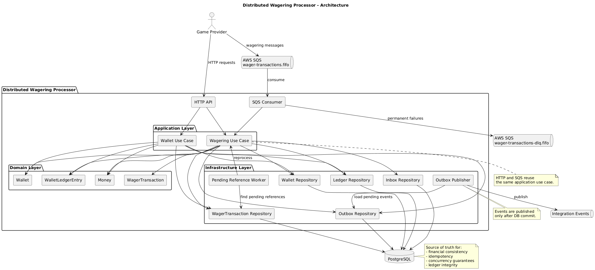

# Architecture

Este documento descreve a arquitetura do **Distributed Wagering Processor**, um
serviço financeiro distribuído que processa transações de apostas recebidas de
múltiplos provedores de jogos. Ele apresenta os principais componentes, os
boundaries entre camadas, as invariantes que dirigem o desenho e as decisões
técnicas tomadas até aqui, sempre com a justificativa, o trade-off aceito e a
limitação conhecida quando existirem. Instruções de instalação, comandos e
diagnóstico do ambiente local ficam no [README.md](./README.md).

O documento distingue explicitamente o que já está implementado do que ainda é
arquitetura planejada. Essa distinção fica concentrada na tabela de *Estado da
implementação*, logo abaixo; nas demais seções ela aparece apenas como uma marca
curta de status quando ajuda a evitar leitura equivocada. Decisões
conscientemente em aberto são apresentadas como pendentes, em vez de resolvidas
arbitrariamente para dar ao texto uma falsa aparência de completude.

A organização é a seguinte: primeiro a arquitetura geral da aplicação, seus
componentes e o fluxo de uma operação financeira; em seguida os princípios e
invariantes que a orientam; depois o detalhamento do domínio financeiro,
persistência e estratégia transacional, concorrência, idempotência e
processamento assíncrono; por fim contratos HTTP, autenticação, observabilidade
e um registro consolidado de trade-offs, limitações e decisões pendentes.

---

## Estado da implementação

| Área | Estado |
| --- | --- |
| Bootstrap NestJS, logger JSON, shutdown hooks | Implementado |
| Configuração PostgreSQL/MikroORM, Docker Compose, fluxo de migrations | Implementado e validado |
| Domínio financeiro: `Money`, `Wallet`, `WalletLedgerEntry`, `WagerTransaction`, regras de referência | Implementado |
| Schema financeiro, constraints, índices e migration reversível | Implementado e validado |
| Mappings e conversão entre domínio e persistência | Implementado |
| Repositories orientados aos casos de uso | Planejado |
| Casos de uso de wagering e de wallet | Planejado |
| Locking operacional por wallet | Planejado |
| Idempotência aplicada: canonicalização, `payloadHash` e replay | Planejado, com a garantia de unicidade já no schema |
| Inbox, Outbox, SQS Consumer e Outbox Publisher | Planejado |
| Worker de `PENDING_REFERENCE` | Planejado |
| Endpoints HTTP, reconciliação e health checks | Planejado |
| Métricas | Planejado |
| Autenticação | Fora de escopo por decisão registrada |

O domínio é código puro: não importa NestJS, MikroORM, PostgreSQL nem SQS, e
seus testes executam sem banco, container ou variável de conexão. Ele também não
lê o relógio nem gera identificadores — datas e ids são fornecidos por quem
chama, o que mantém as regras determinísticas e testáveis.

---

## Arquitetura da aplicação

A Figura 1 apresenta o diagrama de componentes do Distributed Wagering
Processor, representando os principais elementos responsáveis pelo recebimento,
processamento, persistência e publicação das transações financeiras.



**Figura 1: Diagrama de componentes.**

O diagrama e a narrativa a seguir descrevem a arquitetura-alvo completa; a
tabela acima indica quais desses componentes já existem no código.

O **Game Provider** representa os provedores externos de jogos que originam as
transações processadas pelo sistema. Essas transações podem chegar à aplicação
de duas formas: por meio de requisições HTTP enviadas para a **HTTP API** ou de
forma assíncrona, por meio de mensagens publicadas na fila
`wager-transactions.fifo` do AWS SQS.

A **HTTP API** é a interface de entrada síncrona. Ela recebe as requisições dos
provedores e encaminha as operações de wagering para o **Wagering Use Case**; as
operações de criação e consulta de wallets vão para o **Wallet Use Case**.

A fila `wager-transactions.fifo` é o canal de entrada assíncrono. Suas mensagens
são recebidas pelo **SQS Consumer**, que encaminha as operações para o mesmo
**Wagering Use Case**. Tanto as transações recebidas por HTTP quanto as vindas
do SQS utilizam o mesmo caso de uso, evitando que as regras de processamento
sejam duplicadas entre os dois canais de entrada.

O **Wagering Use Case** coordena o processamento de `BET`, `WIN`, `LOSS`,
`REFUND` e `ROLLBACK`. Para isso utiliza os elementos da camada de domínio —
principalmente `Wallet`, `WagerTransaction`, `WalletLedgerEntry` e `Money` — e
comunica-se com os repositórios responsáveis pela persistência das wallets,
transações, lançamentos do ledger, mensagens da Inbox e eventos da Outbox.

O **Wallet Use Case** coordena as operações relacionadas às wallets, incluindo
sua criação e a geração da transação interna `OPENING`. Assim como o Wagering
Use Case, utiliza os elementos do domínio e os repositórios necessários para
persistir as alterações realizadas.

A **Domain Layer** concentra os elementos e regras do domínio financeiro.
`Money` representa valores monetários de maneira exata e associada a uma moeda;
`Wallet` representa a carteira financeira de um jogador e controla as alterações
de seu saldo; `WagerTransaction` representa as operações de wagering e seus
estados; e `WalletLedgerEntry` representa os lançamentos imutáveis que registram
as alterações financeiras realizadas sobre uma wallet.

Os **Repositories** ligam os casos de uso ao **PostgreSQL**. O `Wallet
Repository` responde pela persistência e recuperação das wallets; o
`WagerTransaction Repository`, pelas transações; o `Ledger Repository`, pelos
lançamentos financeiros; o `Inbox Repository`, pelas mensagens consumidas do
SQS; e o `Outbox Repository`, pelos eventos a publicar. Eles encapsulam o acesso
à infraestrutura de persistência, mantendo casos de uso e domínio desacoplados
dos detalhes de acesso ao banco.

O **PostgreSQL** é o mecanismo de persistência e a principal fonte de
consistência do sistema. Nele ficam wallets, transações, ledger, Inbox e Outbox.
Além de persistir, o banco participa das garantias de concorrência, idempotência
e integridade financeira: alterações financeiras, lançamento do ledger e
registros de Inbox e Outbox são confirmados de forma atômica quando participam
da mesma operação. Essa responsabilidade é central porque os mecanismos de
ordenação e deduplicação oferecidos pelo broker são auxiliares, não a garantia
final das invariantes.

A **Inbox** participa do processamento das mensagens recebidas do SQS. O `Inbox
Repository` registra persistentemente cada mensagem consumida, permitindo
detectar redeliveries e impedir que uma mesma mensagem produza efeitos
financeiros novamente. O registro da Inbox participa da mesma transação SQL da
alteração financeira, do ledger e da Outbox.

A **Outbox** armazena os eventos de integração gerados durante o processamento.
O **Outbox Publisher** consulta, pelo `Outbox Repository`, os eventos ainda não
publicados e os envia ao destino de mensageria. O evento é primeiro persistido
junto da operação financeira e só é publicado depois do commit, o que evita
publicar um evento referente a uma alteração que ainda não foi confirmada.

O **Pending Reference Worker** reprocessa as operações em `PENDING_REFERENCE`.
Ele consulta as transações pendentes pelo `WagerTransaction Repository` e
reencaminha as elegíveis ao Wagering Use Case. Esse fluxo é necessário quando um
`REFUND` ou `ROLLBACK` chega antes da transação referenciada.

A **Dead Letter Queue (DLQ)** recebe as mensagens que não puderam ser
processadas dentro da política de tentativas do consumo assíncrono, isolando-as
para análise posterior sem bloquear o processamento das demais.

### Boundaries

O desenho separa quatro camadas, e a direção das dependências é sempre para
dentro:

* **`interfaces`** — controllers HTTP e o SQS Consumer, atuando apenas como
  adaptadores de entrada. Validam formato e traduzem transporte, sem conter
  regra financeira. *(planejado)*
* **`application`** — casos de uso. Orquestram domínio, repositórios e fronteira
  transacional. São o único ponto em que HTTP e SQS convergem. *(planejado)*
* **`domain`** — `src/domain`, com `shared` (`Money`, erros e `FailureCode`),
  `wallet` (`Wallet`, `WalletLedgerEntry`, `LedgerDirection`) e `wagering`
  (`WagerTransaction` e as regras de referência). *(implementado)*
* **`infrastructure`** — `src/infrastructure/persistence`, com a configuração do
  ORM, o tipo monetário, os *persistence records*, os mappers e as migrations.
  *(implementado)* Repositórios, publisher e cliente SQS entram aqui depois.

`src/main.ts` e `src/app.module.ts` são composição do framework, não casos de
uso. Nenhuma pasta é criada vazia e não existem placeholders: uma camada só
aparece quando recebe implementação concreta.

### Fluxo de uma operação financeira

O caminho de uma `BET` mostra a fronteira transacional e vale para as demais
operações, com as diferenças descritas em *Domínio financeiro*. Dentro de uma
única transação PostgreSQL, o caso de uso deverá:

1. registrar a mensagem na Inbox, quando a origem for SQS, detectando
   redelivery;
2. identificar replay ou conflito de idempotência pela chave e pelo
   `payloadHash`;
3. carregar a wallet sob a estratégia de concorrência adotada;
4. validar moeda, referência e disponibilidade de saldo pelas regras do domínio;
5. persistir a `WagerTransaction`;
6. aplicar a movimentação na wallet e criar exatamente um `WalletLedgerEntry`;
7. registrar os eventos de integração correspondentes na Outbox;
8. confirmar tudo de uma vez, ou nada.

Saldo insuficiente marca a transação como `REJECTED`: ela é persistida e
auditável, mas não altera o saldo nem gera lançamento. Operações sem efeito
financeiro, como `LOSS`, seguem o mesmo caminho sem produzir lançamento. A
publicação dos eventos acontece somente depois do commit, pelo Outbox Publisher,
e o `ack` da mensagem SQS também.

---

## Princípios e invariantes

A arquitetura é orientada pelas seguintes invariantes globais:

* um crédito não pode ser aplicado mais de uma vez;
* um débito não pode ser aplicado mais de uma vez;
* o saldo de uma wallet nunca pode ficar negativo;
* eventos confirmados não podem ser perdidos;
* toda alteração de saldo tem um lançamento correspondente no ledger, e
  vice-versa;
* operações concorrentes não podem causar *lost updates*;
* a solução deve permanecer correta com múltiplas instâncias da aplicação.

A invariante final, verificável a qualquer momento, é
`wallet.balance == saldo reconstruído pelo ledger`.

O sistema assume entrega *at-least-once* no SQS: uma mesma operação pode chegar
várias vezes, operações dependentes podem chegar fora de ordem, várias
instâncias podem tocar a mesma wallet ao mesmo tempo e processos podem morrer
antes ou depois de um commit. Por isso o PostgreSQL é a autoridade final de
consistência, e as garantias críticas de unicidade, imutabilidade e
não-negatividade devem ser reforçadas pelo schema, não apenas pelo código da
aplicação. Ordenação e deduplicação do broker são otimizações, nunca a garantia
final.

---

## Domínio financeiro

O domínio encapsula as invariantes em value objects e entidades com construtor
privado e factories explícitas (`from`, `open`, `create`, `createOpening`,
`rehydrate`). `rehydrate` apenas reconstrói estado já persistido: não revalida
regras de criação, não reaplica movimentações, não incrementa `version` e não
gera novos identificadores ou timestamps.

### Money

`Money` guarda um `bigint` de unidades menores (centavos) e o código da moeda.
Não existe conversão intermediária para `number` em nenhum caminho: entrada,
aritmética e serialização operam sobre string e `bigint`. A instância é
congelada em runtime e toda operação devolve uma nova instância.

Nenhuma biblioteca decimal foi adicionada. O domínio precisa apenas de soma,
subtração, negação e comparação, todas fechadas sobre inteiros; divisão e
multiplicação não aparecem, porque reversão parcial e cálculo proporcional estão
fora do escopo. Uma dependência decimal traria arredondamento e configuração de
precisão sem exercitar nada que `bigint` não resolva de forma exata. Se um
requisito futuro exigir divisão, a decisão deve ser revista aqui.

A escala é fixa em duas casas para todas as moedas, conforme o contrato do
desafio. Moedas com outro expoente (JPY, KWD) não são tratadas corretamente e
exigiriam escala por moeda. A validação de moeda é apenas de formato ISO-4217
alfabético (`^[A-Z]{3}$`), sem catálogo: o modelo permanece multi-moeda e as
operações entre moedas diferentes falham, que é o comportamento que o desafio
exige testar, mesmo que a execução opere só com `BRL`.

O formato aceito na entrada é canônico e estrito: sinal opcional, parte inteira
sem zeros à esquerda e exatamente duas casas decimais. São rejeitados `""`,
`"25"`, `"25.5"`, `"25.000"`, notação científica, `NaN`, `Infinity`, espaços nas
bordas, `"+25.00"`, `"007.00"`, `"-0.00"` e valores que não sejam string. Casas
excedentes nunca são arredondadas em silêncio — são erro. A forma canônica única
importa porque o `payloadHash` da idempotência será calculado sobre esses
valores.

`Money` admite valores negativos, produzidos legitimamente por `negate()` e
`subtract()`. A proibição de negativos vive nos contratos de criação e
movimentação (`Wallet.open`, `Wallet.debit`, `Wallet.credit`,
`WagerTransaction.create`, `WalletLedgerEntry.create`), não no value object.
`equals` entre moedas diferentes devolve `false`; `isLessThan`, `add` e
`subtract` entre moedas diferentes lançam `CurrencyMismatchError`, porque
ordenar ou somar moedas distintas não tem significado.

O intervalo representável é finito e casado com a coluna do banco: até
`999999999999999999.99` em módulo. O limite é verificado no construtor, então
toda instância nasce válida, inclusive as produzidas por `add` e `subtract` — um
estouro falha na operação que o causou, e não mais tarde, num `INSERT`. Ver
*Persistência de Money* para a coluna correspondente e o porquê do valor.

O contrato externo permanece `{ "amount": "25.00", "currency": "BRL" }`. O
domínio é independente dos tipos monetários do MikroORM e de decorators do
NestJS.

### Wallet e ledger

`Wallet` é o aggregate root do saldo materializado e garante que:

* abre com saldo não negativo e `version` igual a `1`;
* `version` incrementa apenas quando o saldo muda de fato;
* movimentação de valor zero ou negativo não é movimentação financeira e é
  recusada;
* débito nunca deixa o saldo negativo;
* crédito e débito exigem a moeda da wallet;
* validações acontecem antes de qualquer atribuição, de modo que uma operação
  recusada não deixa estado parcialmente alterado.

`debit` e `credit` devolvem um `WalletMovement` com direção, valor e saldos antes
e depois — exatamente os dados que o lançamento do ledger consome. Isso evita
recalcular o movimento ao criar o lançamento, mas não obriga o chamador a persistir
ambos. Persistir esse par atomicamente continua sendo responsabilidade da
aplicação e do PostgreSQL: nada em memória garante atomicidade.

`Wallet.open` devolve `{ wallet, movement }`. Com saldo inicial positivo,
`movement` descreve o crédito de abertura de zero até o saldo inicial e a
`version` permanece `1`, porque a abertura é a criação da wallet e não uma
alteração posterior. Compor `Wallet`, a `WagerTransaction` interna `OPENING` e o
`WalletLedgerEntry` em uma única transação SQL é trabalho do Wallet Use Case,
planejado.

`WalletLedgerEntry` é imutável por construção, não por convenção: não tem campos
mutáveis nem métodos de alteração ou exclusão, e a instância é congelada.
`createdAt` é copiado na entrada e na leitura, para que a `Date` recebida ou
devolvida não permita alterar um lançamento. A factory `create` valida valor de
movimentação estritamente positivo, moeda consistente entre valor,
`balanceBefore` e `balanceAfter`, saldos não negativos e a aritmética
`balanceBefore ± money == balanceAfter`.

O ledger é o registro auditável: lançamentos existentes nunca são sobrescritos
ou removidos para representar novas operações. Reversões são novas operações com
novos lançamentos, o que preserva a rastreabilidade e permite reconstruir o
saldo a partir do histórico. A unicidade por transação e wallet e a proibição de
`UPDATE` e `DELETE` são reforçadas pelo PostgreSQL — ver *Garantias do schema
financeiro*.

### WagerTransaction

`WagerTransaction` representa a operação e sua máquina de estados. As transições
válidas são:

| de \ para | `PENDING_REFERENCE` | `PROCESSED` | `REJECTED` | `FAILED` |
| --- | --- | --- | --- | --- |
| `PENDING` | sim | sim | sim | sim |
| `PENDING_REFERENCE` | não | sim | sim | sim |
| `PROCESSED` | não | não | não | não |
| `REJECTED` | não | não | não | não |
| `FAILED` | não | não | não | não |

`PROCESSED`, `REJECTED` e `FAILED` são terminais. Sair de um deles lança
`InvalidTransactionStateError`, tratado como erro de programação e não como
caminho de negócio. `PENDING_REFERENCE` não se repete: uma tentativa do worker
que não encontra a referência deixa a linha como está, e o controle de
tentativas pertence à aplicação. Apenas `REFUND` e `ROLLBACK` chegam a
`PENDING_REFERENCE`.

`affectsBalance()` é falso apenas para `LOSS`. `matchesPayload` compara o
`payloadHash` recebido; o hash em si é produzido pela camada de idempotência,
não pelo domínio.

#### `OPENING` é interna e não tem identidade externa

`create` recusa `OPENING`; a única porta é `createOpening`, e ela recebe apenas
`id`, wallet, player, valor e instante. Uma abertura não vem de provedor, não
pertence a rodada nem jogo e não nasce de uma requisição idempotente, então
`providerId`, `externalTransactionId`, `idempotencyKey`, `payloadHash`,
`roundId` e `gameId` ficam ausentes — e nulos na tabela — em vez de receberem
valores fictícios como `provider = "internal"`.

A factory externa do domínio recusa `OPENING`; os futuros adaptadores HTTP e SQS
também deverão excluí-lo de seus contratos. A ausência dos campos é
verificada no banco: um CHECK exige que `kind = 'OPENING'` coincida exatamente
com a ausência de toda a identidade externa, nos dois sentidos. Preencher esses
campos com valores inventados só para satisfazer `NOT NULL` teria criado um
provedor fantasma competindo pelas mesmas constraints de unicidade das operações
reais. Um índice parcial garante no máximo uma `OPENING` por wallet.

#### Referência interna e referência externa

`markProcessed` exige o id interno da transação referenciada **exatamente quando**
a operação foi submetida com `referenceExternalTransactionId`:

| Situação | Ao chegar a `PROCESSED` |
| --- | --- |
| `REFUND` e `ROLLBACK` | sempre citam referência externa, logo sempre exigem a interna |
| `WIN` com referência externa | exige a referência interna |
| `WIN` sem referência externa | processa sem referência interna |
| `BET`, `LOSS`, `OPENING` | nunca citam referência, e não aceitam a interna |

A regra é simétrica: se o provedor apontou para uma transação, o registro
processado precisa dizer qual registro interno foi de fato resolvido; se não
apontou, o sistema não inventa um vínculo. As duas informações convivem, porque
respondem a perguntas diferentes — o que o provedor enviou e o que a plataforma
resolveu — e a segunda é uma chave estrangeira autorreferencial. O banco reforça
a mesma equivalência por CHECK.

### Regras de referência

As regras que envolvem duas transações estão em
`src/domain/wagering/reference-rules.ts`, como três funções pequenas:
`assertReversalIsEligible`, `assertWinReferenceIsEligible` e
`assertReversalDoesNotOverdraw`. Validar uma reversão envolve a transação, sua
referência, a wallet e um fato do histórico, o que não cabe naturalmente em uma
única entidade. Não há processador genérico nem framework de regras: a
orquestração continua sendo responsabilidade da aplicação.

Uma reversão exige mesmo provider, player, wallet, moeda e rodada da referência;
`REFUND` só reverte `BET`, `ROLLBACK` reverte `BET`, `WIN` ou `REFUND`; a
referência precisa estar `PROCESSED`; e o valor precisa ser o integral, já que
reversão parcial está fora de escopo. A ordem das verificações é estável porque
define qual `failureCode` o provedor recebe quando mais de uma condição falha:
provider/player/wallet, moeda, rodada, tipo, estado, valor e, por fim, reversão
repetida.

A unicidade da reversão depende do histórico persistido, então o domínio a recebe
como fato explícito (`ReversalFacts.referenceAlreadyReversedBySameKind`),
consultado pela aplicação dentro da mesma transação SQL. Nenhum `Map`, `Set` ou
cache participa dessa garantia. Conforme o desafio, a proibição é por tipo de
operação: uma `BET` já estornada por `REFUND` continua elegível a `ROLLBACK`, e
nenhuma proibição global mais restritiva foi acrescentada.

`ROLLBACK` inverte a direção da referência, então o rollback de um `WIN` ou de um
`REFUND` debita a wallet. Quando esse débito não cabe no saldo, a rejeição usa
`REVERSAL_WOULD_OVERDRAW`, distinto de `INSUFFICIENT_FUNDS`: aposta sem saldo é
situação de jogo, reversão sem saldo é inconsistência operacional entre provedor
e plataforma, e o provedor precisa poder distinguir as duas. `Wallet.debit`
mantém seu próprio guarda como última barreira da invariante de saldo não
negativo.

### Failure codes e categorias de erro

Toda rejeição de negócio carrega um `failureCode` estável e legível por máquina,
suficiente para o provedor decidir se corrige o payload, reenvia ou desiste, sem
interpretar mensagens textuais. Os valores abaixo são o contrato: são
persistidos; sua publicação em eventos continua planejada.

| Código | Situação |
| --- | --- |
| `INSUFFICIENT_FUNDS` | débito, tipicamente `BET`, sem saldo disponível |
| `REVERSAL_WOULD_OVERDRAW` | reversão que deixaria o saldo negativo |
| `CURRENCY_MISMATCH` | moeda divergente da wallet ou da referência |
| `INVALID_AMOUNT` | valor negativo, ou zero em operação que move saldo |
| `REFERENCE_REQUIRED` | `REFUND`/`ROLLBACK` sem `referenceExternalTransactionId` |
| `REFERENCE_NOT_SUPPORTED` | `BET` ou `LOSS` acompanhado de referência |
| `REFERENCE_KIND_NOT_ELIGIBLE` | tipo da referência não pode ser revertido ou associado |
| `REFERENCE_NOT_PROCESSED` | referência existe mas não está `PROCESSED` |
| `REFERENCE_MISMATCH` | referência de outro provider, player, wallet ou rodada |
| `REFERENCE_AMOUNT_MISMATCH` | tentativa de reversão parcial |
| `REFERENCE_ALREADY_REVERSED` | referência já revertida pelo mesmo tipo de operação |

A taxonomia cobre apenas regras já implementadas. Faltam ao menos o código de
referência inexistente após esgotamento das tentativas, que será definido junto
do worker de `PENDING_REFERENCE`, e o de conflito de idempotência, que pertence
ao contrato da camada externa. Mensagens descritivas podem complementar o
código, mas não são o contrato.

#### `REJECTED` e `FAILED` são categorias disjuntas

Uma transação termina em `REJECTED` quando uma regra de negócio a recusa, e o
código vem de `FailureCode`. Termina em `FAILED` quando um erro técnico
permanente impede o processamento, e o código vem de `InfrastructureFailureCode`
— hoje com um único membro, `PERMANENT_INFRASTRUCTURE_FAILURE`, que crescerá
junto da política de retry e DLQ do consumidor.

Os dois espaços de código não se cruzam, e a separação é imposta nas duas
pontas. No domínio, `reject` aceita apenas códigos de negócio e `fail` apenas
códigos técnicos, de modo que algo como `fail(INSUFFICIENT_FUNDS)` sequer
compila. No banco, um CHECK amarra `failure_code` ao `status`: `REJECTED` exige
um código de negócio, `FAILED` exige um código técnico, e os demais estados
exigem ausência de código. A verificação é explícita quanto à obrigatoriedade
porque um CHECK só rejeita `FALSE` — `null in (...)` avalia para `NULL` e
passaria, deixando entrar uma transação rejeitada sem motivo registrado.

Confundir as categorias não seria detalhe cosmético: um provedor decide reenviar
ou corrigir o payload a partir dessa distinção, e uma falha técnica anunciada
como rejeição de negócio o levaria a desistir de uma operação que deveria ter
sido repetida.

#### Categorias de exceção

As exceções ficam em três categorias, para que a aplicação não trate todo erro
como rejeição de negócio:

* `InvalidInputError` — dado malformado ou uso indevido de uma API do domínio;
  não tem `failureCode`;
* `DomainRuleViolationError` — rejeição financeira, sempre com `failureCode`;
* `InvalidTransactionStateError` — erro de programação em uma transição.

### Interpretações adotadas

O desafio não fecha alguns pontos; as escolhas abaixo foram feitas aqui:

* **Escala de entrada.** Exigimos exatamente duas casas decimais. `"25"` e
  `"25.5"` são erro de escala, não valores a normalizar, e `"-0.00"` é recusado
  para que o zero tenha forma única.
* **Valor zero.** `BET`, `WIN`, `REFUND` e `ROLLBACK` exigem valor estritamente
  positivo: um lançamento de zero quebraria a correspondência entre alteração de
  saldo e ledger, e uma transação `PROCESSED` sem lançamento seria ambígua para
  auditoria e para reversões futuras. `LOSS` aceita zero, porque apenas registra
  o resultado da rodada.
* **Referência opcional em `WIN`.** Quando informada, precisa ser compatível e
  apontar para uma `BET` `PROCESSED`. O valor **não** precisa coincidir: um
  prêmio é naturalmente diferente da aposta. Como `WIN` não é reversão, a regra
  de reversão única não se aplica a ela.
* **`OPENING` sem rodada e sem jogo.** `roundId` e `gameId` ficam ausentes no
  domínio e são mapeados para `NULL`. O CHECK de identidade interna exige essa
  ausência para `OPENING` e exige os campos nas operações externas.
* **Timestamp de rejeição.** `processedAt` é preenchido somente por
  `markProcessed`, como no esqueleto do desafio. O instante de uma rejeição fica
  a cargo das colunas de auditoria da persistência.
* **Identificadores.** São opacos para o domínio, mas precisam ser strings não
  vazias e já normalizadas: espaços nas bordas são recusados em vez de
  removidos, porque `"provider-a "` e `"provider-a"` seriam identidades
  distintas no banco e produziriam hashes distintos.

---

## Persistência e estratégia transacional

MikroORM é o ORM adotado, pela integração com PostgreSQL e pelos mecanismos
explícitos de Unit of Work, transações e locking, que tornam a fronteira
transacional visível no código em vez de implícita. PostgreSQL é ao mesmo tempo
o mecanismo de persistência e a autoridade final de consistência.

A persistência permanece separada do domínio: as classes de domínio não carregam
decorators nem tipos do ORM. O mapeamento vive inteiramente na infraestrutura,
em *persistence records* — objetos planos, descritos por `EntitySchema`, com
colunas escalares e sem relações declaradas — mais mappers que traduzem nos dois
sentidos. A volta usa sempre as factories `rehydrate`, que reconstroem estado
persistido sem gerar ids ou timestamps, sem incrementar `version` e sem
reaplicar movimentações. Os records não repetem regra financeira alguma:
representam armazenamento.

Duas consequências dessa escolha merecem registro. A conversão precisa traduzir
o `null` do SQL para o `undefined` do domínio, sob pena de o tipo declarado
mentir sobre o valor que carrega. E, sem relações declaradas, o ORM não deduz a
ordem de inserção entre wallet, transação e lançamento — quem orquestra a
operação respeita essa dependência explicitamente, o que é aceitável porque a
ordem já é uma decisão consciente dentro da transação financeira.

Cada operação trabalha em um contexto isolado, sem contexto global compartilhado
entre requisições ou workers, e as transações são abertas explicitamente — não há
transação implícita como efeito colateral de um repositório. Não existem wrappers
transacionais nem repositórios genéricos: eles só serão criados quando houver
caso de uso concreto.

Desenvolvimento e teste usam bancos separados, com configuração própria, para
que uma execução de teste nunca alcance os dados de desenvolvimento; o custo de
manter dois ambientes é aceito em troca desse isolamento. Os logs internos do
ORM ficam desabilitados para não expor SQL nem credenciais, ao custo de um
diagnóstico de infraestrutura mais pobre — limitação aceita nesta fase. Os
detalhes de execução local estão no [README.md](./README.md).

### Migrations

Toda alteração de schema passa por migration versionada e reversível, com o
`down` revisado, e as migrations são aplicadas dentro de transação. Não há
schema sync, criação automática de banco nem execução de migrations no startup:
migrar é um passo explícito de implantação, o que importa porque múltiplas
instâncias sobem em paralelo e não podem disputar a evolução do schema entre si.

O schema financeiro é criado por uma única migration, escrita à mão em vez de
gerada pelo diff das entidades: constraints compostas, índices parciais e
triggers não são expressos no metadata do ORM, e o SQL revisado é o que
realmente define as garantias. O gerador continua disponível, mas não é a fonte
da verdade — a contrapartida é que a divergência entre metadata e schema não é
detectada automaticamente, e sim pelos testes de integração.

As listas de `kind`, `status` e `failure_code` aparecem literalmente na
migration, não derivadas dos enums. Uma migration é o registro histórico do
schema em um ponto no tempo: se lesse o enum atual, aplicar a mesma versão em
dois momentos produziria bancos diferentes. Ampliar qualquer lista exige nova
migration, e um teste compara os enums com as constraints reais para que a
divergência apareça como falha.

A reversibilidade é verificada contra PostgreSQL real no ciclo completo
`up → down → up`, conferindo tabelas, constraints, índices, triggers e a função
usada pelos triggers antes e depois do `down`.

### Fronteira transacional

Uma operação financeira só é considerada confirmada quando todos os seus efeitos
obrigatórios forem persistidos. Conforme o tipo de entrada e de operação, a mesma
transação SQL deve abranger:

* a `WagerTransaction`;
* a alteração da `Wallet`;
* o `WalletLedgerEntry`, quando houver movimentação financeira;
* a `InboxMessage`, quando a origem for SQS;
* a `OutboxMessage` correspondente aos eventos produzidos.

O objetivo é tudo-ou-nada: nenhuma operação confirma alteração de saldo sem o
lançamento correspondente, nem confirma efeito financeiro sem registrar os
eventos que precisarão ser publicados. Eventos nunca são publicados de dentro da
transação financeira.

### Persistência de Money

Valores monetários são persistidos em `numeric(20, 2)`, com a moeda em coluna
`char(3)` separada. O domínio continua guardando `bigint` de unidades menores, e
a fronteira entre os dois é sempre a string decimal canônica:

```text
Money (bigint de centavos)  ↔  "25.00"  ↔  numeric(20,2)
```

`numeric` foi escolhido em vez de `BIGINT` de centavos por três razões
concretas. A escala declarada é preservada na saída, então a coluna devolve
exatamente `"25.00"` — a mesma forma que `Money.from` aceita, sem reformatação
que pudesse introduzir erro. A aritmética de `numeric` é exata, o que permite
expressar a conferência do ledger como CHECK legível
(`balance_after = balance_before + amount`) e somar o ledger em SQL na futura
reconciliação. E o valor é auditável direto no banco: quem inspeciona a tabela
lê `25.00`, não `2500`, o que importa em investigação financeira.

O trade-off aceito é que `numeric` ocupa mais espaço e é mais lento que um
inteiro nativo. Para o volume deste serviço isso não pesa perto do ganho de
exatidão e legibilidade. `BIGINT` teria a vantagem de espelhar a representação
em memória sem conversão, mas exigiria formatar centavos como decimal em toda
leitura e transformaria os CHECKs aritméticos em contas sobre inteiros — mais
rápido e menos legível, num ponto em que legibilidade vale mais.

Nenhum caminho monetário passa por `number`. O driver entrega `numeric` como
string, e um tipo próprio do MikroORM valida a forma decimal na entrada e na
saída, falhando alto se algum dia receber `number` — acima de
`Number.MAX_SAFE_INTEGER` a perda aconteceria antes de qualquer validação de
domínio e sem deixar rastro.

O range é finito e casado nos dois lados: `numeric(20, 2)` tem 20 dígitos de
precisão, sendo 18 inteiros e 2 decimais, e comporta até
`999999999999999999.99`, e o mesmo limite é aplicado no construtor de `Money`.
Exceder a capacidade é erro de domínio explícito, inclusive quando o estouro
nasce de uma soma, e não um overflow surgido no meio de um `INSERT`.

### Garantias do schema financeiro

O banco reforça as invariantes estruturais e locais; regras que dependem de
histórico ou de outra transação continuam no domínio e na aplicação.

**`wallets`** — unicidade de `(player_id, currency)`, saldo não negativo,
`version >= 1` e formato ISO-4217 da moeda. Uma unicidade adicional em
`(id, currency)` existe para servir de alvo às chaves compostas descritas
abaixo.

**`wager_transactions`** — `kind` e `status` restritos aos valores do domínio.
Valor não negativo, e estritamente positivo em tudo que não seja `LOSS`. A
identidade externa é tratada em bloco: ou a transação tem provider, id externo,
chave de idempotência, payload hash, rodada e jogo, ou não tem nenhum deles —
e a ausência total é exatamente o que caracteriza `OPENING`. `REFUND` e
`ROLLBACK` exigem referência externa; `BET`, `LOSS` e `OPENING` não a aceitam.
`PENDING_REFERENCE` só é possível para reversões. `processed_at` existe se e
somente se o status é `PROCESSED`. A referência interna existe se e somente se
a transação está `PROCESSED` e citou uma referência externa, e nunca aponta
para si mesma.

**`wallet_ledger_entries`** — valor estritamente positivo, saldos não negativos,
direção restrita a `DEBIT`/`CREDIT` e a aritmética conferida por CHECK nos dois
sentidos. No máximo um lançamento por `(transaction_id, wallet_id)`.

A coerência de moeda entre as três tabelas não depende de trigger nem de
verificação na aplicação: as chaves estrangeiras são compostas. Transação e
lançamento referenciam `wallets (id, currency)`, o que torna impossível gravar
uma operação em moeda diferente da wallet; e o lançamento referencia
`wager_transactions (id, wallet_id)`, o que impede vinculá-lo a uma transação de
outra wallet. O custo é um índice único redundante em cada tabela alvo, aceito
por resolver com integridade referencial o que de outro modo viraria SQL
condicional.

Todas as chaves estrangeiras usam `RESTRICT` em `UPDATE` e `DELETE`. Não existe
cascade em dado financeiro: apagar uma wallet ou uma transação que já tenha
lançamento é recusado pelo banco, porque histórico auditável não deve
desaparecer como efeito colateral.

Os índices atendem consultas já exigidas pelo desafio: unicidade de
`(provider_id, external_transaction_id)` para resolver referências e detectar
reenvio; unicidade da identidade de idempotência; um índice parcial garantindo
uma única `OPENING` por wallet; `(wallet_id, created_at)` para o histórico de
transações; um índice parcial por `PENDING_REFERENCE` para o worker de
referências; e `(wallet_id, created_at, id)` para a paginação estável do ledger.

#### Imutabilidade do ledger no PostgreSQL

A ausência de métodos de alteração no código é convenção; a garantia está no
banco. Três triggers sobre `wallet_ledger_entries` rejeitam `UPDATE`, `DELETE` e
`TRUNCATE`, chamando uma função que levanta exceção. A migration cria a função e
os triggers no `up` e os remove no `down` — a função é um objeto à parte e não
some junto com a tabela. Correções financeiras continuam sendo novas operações
com novos lançamentos, nunca edição de histórico.

---

## Concorrência

*Decisão tomada; a implementação acompanha os repositórios e casos de uso.*

A unidade de concorrência é `walletId`. A estratégia adotada é **pessimistic
locking por wallet**, usando os mecanismos transacionais do PostgreSQL via
MikroORM: operações sobre a mesma wallet serão serializadas durante sua seção
crítica, enquanto wallets diferentes continuam sendo processadas em paralelo.

A escolha prioriza correção demonstrável e simplicidade de raciocínio sobre
sofisticação. O benefício principal é tornar direta a ausência de *lost updates*
e de saldo negativo sob concorrência. O trade-off aceito é a contenção em
wallets muito disputadas, com aumento de latência; como o lock é restrito à
wallet afetada, o impacto não se propaga para o resto do sistema.

Não é usado lock global da aplicação nem qualquer sincronização em memória,
porque a solução precisa permanecer correta com três ou mais instâncias
executando simultaneamente — um mutex de processo não protege nada nesse
cenário. Alterações de saldo também não podem ser um `read → calculate → update`
sem controle explícito de concorrência.

O cenário obrigatório do desafio é o teste dessa escolha: com saldo inicial de
`100.00 BRL` e duas apostas simultâneas de `80.00 BRL`, exatamente uma deve
resultar em `PROCESSED` e a outra em `REJECTED` por saldo insuficiente, com
saldo final de `20.00 BRL` e um único lançamento de débito. Após a primeira
operação confirmar o débito, a segunda observa o saldo atualizado.

**Papel de `version`.** `version` é a versão observável e auditável do estado
financeiro da wallet, e nada além disso. Começa em `1` na abertura e incrementa
somente quando o saldo muda de fato; o banco garante `version >= 1`.

Ela **não** é usada como coluna de optimistic locking do MikroORM. O recurso do
ORM incrementa a versão a cada `flush` da entidade alterada, o que quebraria a
semântica acima assim que qualquer campo não monetário mudasse — a `version`
deixaria de contar movimentações de saldo e passaria a contar gravações. Somar
optimistic locking ao lock pessimista também traria um segundo mecanismo de
concorrência para raciocinar e testar, sem cobrir nenhum cenário que o primeiro
já não cubra. O controle de concorrência é o lock pessimista por wallet, e o
domínio permanece dono do incremento.

---

## Idempotência

*A unicidade persistente já existe no schema. A canonicalização, o cálculo do
hash e o replay pertencem à camada de aplicação e continuam planejados; o domínio
expõe a parte que lhe cabe, `payloadHash` e `matchesPayload`.*

A idempotência é persistente e nunca depende de memória local da aplicação:
nenhum cache, `Map` ou `Set` é fonte da verdade. A garantia final contra
processamento duplicado vem de constraints de unicidade no banco.

No contrato planejado de HTTP, a chave obrigatória virá do header
`Idempotency-Key`. No SQS, virá do payload da mensagem. Nos dois casos será
persistida junto da transação como identidade daquela tentativa lógica.

**Escopo da unicidade.** A identidade de idempotência é
`(providerId, idempotencyKey)`, não a chave sozinha. Provedores são inquilinos
distintos da plataforma, e uma unicidade global permitiria que um deles
interferisse no outro: bastaria escolher uma chave já usada para que a
requisição legítima do primeiro passasse a ser tratada como conflito, além de
revelar que aquela chave existe em algum lugar do serviço. O escopo por provider
elimina essa classe de problema sem custo para quem segue o formato recomendado
pelo desafio (`{providerId}:{externalTransactionId}`), que já é único entre
provedores por construção — as duas alternativas só divergem quando um provedor
escolhe uma chave curta, e é justamente aí que a versão global falharia.

Isso mantém duas identidades distintas, ainda que os valores costumem ser
derivados um do outro:

| Identidade | Escopo | Responde a |
| --- | --- | --- |
| `(providerId, externalTransactionId)` | provider | qual operação o provedor enviou |
| `(providerId, idempotencyKey)` | provider | qual tentativa lógica é esta |

Nenhuma das duas substitui a outra. A primeira resolve referências de `REFUND` e
`ROLLBACK` e identifica a operação no vocabulário do provedor; a segunda decide
entre replay e conflito. `OPENING` não participa de nenhuma delas: sendo interna,
não tem provider nem chave, e o índice de idempotência é parcial justamente para
deixar isso explícito em vez de depender de como o banco trata nulos.

A aplicação não deriva nem substitui silenciosamente uma chave ausente por um
valor construído a partir de outros campos. Uma entrada sem chave é entrada
inválida, tratada como tal na borda, e não uma operação a processar sob uma
identidade inventada pela plataforma — inventá-la deslocaria a decisão de
identidade do provedor para o serviço, exatamente onde ela não pode estar.

A chave e o `payloadHash` são mecanismos separados e complementares: a chave
identifica a tentativa, o hash detecta que a mesma chave voltou com um payload
diferente. O `payloadHash` será calculado sobre uma representação JSON canônica dos
campos de negócio, com chaves ordenadas, sem o header nem metadados de
transporte; o algoritmo é SHA-256. A canonicalização e o cálculo pertencem à
camada de idempotência: o domínio apenas recebe o hash e o compara
(`matchesPayload`), o que mantém a regra de negócio independente do formato de
transporte.

O comportamento de replay a implementar para uma chave já existente será:

* hash igual → replay; a operação retorna o resultado original, incluindo o
  saldo observado naquele momento, e não o saldo atual da wallet;
* hash diferente → conflito de idempotência; nenhum novo efeito financeiro é
  produzido.

---

## Processamento assíncrono

Toda esta seção descreve componentes planejados.

### Inbox

Mensagens recebidas do SQS são registradas em uma Inbox persistente, com
identidade `(consumerName, messageId)`. O registro participa da mesma transação
SQL dos efeitos financeiros produzidos pela mensagem, e o `ack` só ocorre depois
do commit. Com isso, uma mensagem reentregue após uma falha é reconhecida como
já processada, sem repetir efeitos financeiros.

### Outbox

Eventos de integração são persistidos em uma Outbox dentro da mesma transação
SQL que grava os efeitos financeiros. Um worker independente consulta os eventos
pendentes e os publica depois.

A Outbox adiciona complexidade operacional e exige um worker a mais. Em troca,
evita o problema de confirmar a operação financeira no PostgreSQL e perder seu
evento porque o processo morreu antes de publicar. A arquitetura aceita
explicitamente a possibilidade de publicação duplicada em troca da garantia de
que eventos confirmados não sejam silenciosamente perdidos; consumidores não
podem depender de *exactly-once* e precisam ser seguros diante de duplicatas.

Os eventos mínimos exigidos pelo desafio são `WagerTransactionProcessed`,
`WagerTransactionRejected`, `WalletBalanceChanged` — este apenas quando o saldo
muda de fato — e `WagerTransactionPendingReference`. O payload precisa ser JSON
estável e versionável, com os valores monetários em forma serializada e não como
instâncias de `Money`, para que o formato do evento não fique preso à
representação interna do domínio.

Os eventos ainda não foram implementados. O contrato exige tipos concretos
derivados de `IntegrationEvent`, cada um definindo tipo, versão e dados, com
valores monetários em `MoneyProps`. Os campos restantes do envelope e dos
payloads ainda precisam ser definidos. O
comportamento com múltiplos publishers concorrentes sobre a mesma Outbox precisa
evitar tanto perda quanto duplicação indefinida, e o mecanismo de seleção e
reserva de eventos também permanece pendente.

### Operações fora de ordem e `PENDING_REFERENCE`

`REFUND` e `ROLLBACK` dependem de uma transação previamente processada. Quando a
referência ainda não existe, a operação é persistida como `PENDING_REFERENCE` em
vez de ser descartada ou rejeitada de imediato — rejeitar uma operação válida só
porque sua referência ainda não chegou seria incorreto sob entrega fora de
ordem.

Um worker agendado reprocessa as operações pendentes com backoff exponencial e
um limite finito de tentativas. Esgotado o limite, a operação passa a `REJECTED`
com um `failureCode` que identifique a referência inexistente, e o evento
correspondente é registrado para publicação. Os valores concretos de número
máximo de tentativas, intervalos e TTL ainda não foram definidos e serão
registrados aqui quando implementados e validados.

### Retry, erros transitórios e DLQ

O consumo assíncrono distingue três classes de erro, e essa distinção é o que
evita retries infinitos sobre problemas que nunca vão se resolver sozinhos:

* **negócio** — terminal; a transação é rejeitada com `failureCode` e a mensagem
  recebe `ack`;
* **transitório de infraestrutura** — nova tentativa com backoff;
* **permanente** — segue a política de DLQ.

Haverá um limite explícito de tentativas antes da DLQ. Em `SIGTERM`, mensagens em
andamento devem ser concluídas quando possível ou ter sua visibilidade devolvida
para redelivery. Os valores concretos de tentativas, visibilidade e backoff ainda
não foram decididos.

---

## Contratos HTTP e autenticação

*Endpoints planejados. Hoje a aplicação sobe o servidor HTTP sem registrar
nenhuma rota de negócio.*

Os endpoints seguirão os contratos do desafio: criação e consulta de wallets,
submissão e consulta de transações de wagering, reconciliação e health checks
separados para liveness e readiness. Controllers permanecem finos: validação de
formato pertence à borda, invariantes de negócio permanecem no domínio.

O mapeamento de status HTTP precisa distinguir de forma consistente, em todos os
endpoints, payload inválido, conflito de idempotência, rejeição por regra de
negócio, aceite com processamento pendente e falha transitória de
infraestrutura. Colapsar essas situações obrigaria o provedor a interpretar
mensagens para decidir se pode reenviar. **O mapeamento exato entre essas
categorias e os códigos HTTP ainda não foi decidido** e será registrado quando os
controllers forem implementados.

Divergências detectadas na reconciliação não são corrigidas silenciosamente:
devem ser logadas, contabilizadas em métrica e sinalizadas na resposta.

**Autenticação não será implementada nesta entrega.** É uma decisão de escopo,
não uma recomendação de produção: o desafio não atribui pontos a autenticação, e
o esforço foi concentrado em correção financeira, concorrência, idempotência,
mensageria e recuperação após falhas. Em produção, a autenticação seria delegada
a um Identity Provider externo por OIDC, em vez de manter usuários e hashes de
senha dentro deste serviço. A aplicação manterá um ponto de extensão explícito
para a identidade do provedor, sem acoplar as regras financeiras ao mecanismo de
autenticação. Endpoints de health permanecem públicos, e mensagens da fila são
tratadas como canal interno confiável — o que não remove as validações de
domínio sobre a identidade do provedor contida na própria mensagem.

---

## Observabilidade

A aplicação já usa o logger nativo do NestJS em modo JSON. Conforme os fluxos de
negócio forem implementados, os logs passarão a carregar `correlationId`,
`messageId`, `transactionId`, `walletId` e `providerId` quando disponíveis no
contexto. Payloads financeiros completos e informações sensíveis não são
registrados — a decisão de desabilitar os logs internos do ORM segue a mesma
regra.

As métricas planejadas cobrem, no mínimo, transações por status, duplicatas
detectadas, retries, mensagens em DLQ, conflitos de lock, Outbox lag e latência
de processamento. Liveness e readiness serão expostos separadamente: liveness
indicará que o processo está vivo, readiness verificará se PostgreSQL e SQS estão
alcançáveis.

---

## Decisões, trade-offs e limitações

### Trade-offs aceitos

As justificativas completas estão nas seções indicadas; aqui fica apenas o custo
assumido em cada caso.

| Decisão | Custo aceito |
| --- | --- |
| `bigint` de centavos, sem biblioteca decimal (*Money*) | Não cobre moedas com expoente diferente de 2; exigiria revisão se surgir divisão |
| `numeric(20,2)` na persistência (*Persistência de Money*) | Mais espaço e menos velocidade que um inteiro nativo, e um teto de `999999999999999999.99` |
| Migration financeira escrita à mão (*Migrations*) | Divergência entre metadata do ORM e schema não é detectada pelo gerador, só pelos testes |
| Records sem relações declaradas (*Persistência*) | A ordem de inserção entre wallet, transação e ledger é responsabilidade de quem orquestra |
| Chaves estrangeiras compostas para coerência de moeda (*Garantias do schema*) | Um índice único redundante em cada tabela alvo |
| Pessimistic locking por wallet, sem optimistic locking (*Concorrência*) | Contenção e latência em hot wallets |
| PostgreSQL como autoridade final, broker como otimização (*Princípios*) | Não aproveita FIFO/dedup do SQS como garantia, mantendo o custo do controle no banco |
| Transactional Outbox (*Outbox*) | Complexidade operacional, worker adicional e publicação possivelmente duplicada |
| Ledger imutável, correção só por novas operações (*Wallet e ledger*) | Mais linhas e nenhuma correção "in place" de histórico |
| Bancos separados para desenvolvimento e teste (*Persistência*) | Um ambiente PostgreSQL a mais para manter localmente |
| Logs internos do ORM desabilitados (*Persistência*) | Diagnóstico de infraestrutura mais pobre |
| Autenticação omitida (*Contratos HTTP e autenticação*) | Sem identidade verificada do provedor nesta entrega |

### Limitações atuais

As garantias estruturais do schema financeiro são verificadas contra PostgreSQL
real em container, junto com a reversibilidade da migration e o round-trip entre
domínio e persistência. O domínio tem cobertura unitária própria.

O que ainda **não** está demonstrado é o comportamento sob concorrência e sob
entrega duplicada. Atomicidade entre wallet, ledger, inbox e outbox, ausência de
*lost updates*, replay idempotente e recuperação após falha dependem dos
repositories, dos casos de uso e do locking operacional, nenhum deles
implementado. O schema está preparado para essas propriedades — a unicidade da
identidade de idempotência já existe, por exemplo —, mas preparar não é
demonstrar, e os testes de concorrência e mensageria continuam pendentes.

### Decisões pendentes

Localizadas nas seções correspondentes e repetidas aqui para facilitar a
consulta:

* repositories orientados aos casos de uso e a fronteira transacional concreta;
* locking operacional por wallet;
* casos de uso de wagering e de criação de wallet;
* canonicalização JSON e cálculo do `payloadHash`, replay e resposta original;
* política concreta de retry, backoff e TTL para `PENDING_REFERENCE`, e o
  `failureCode` de referência inexistente;
* campos do envelope e payloads concretos dos eventos, respeitando o contrato
  de `IntegrationEvent`, versão por tipo e `MoneyProps`;
* Inbox, Outbox e o mecanismo de coordenação entre publishers concorrentes;
* consumidor SQS, com política concreta de tentativas, visibilidade e DLQ;
* mapeamento definitivo de status HTTP e o `failureCode` de conflito de
  idempotência;
* reconciliação, métricas e demais itens de observabilidade ainda não
  implementados.

Quando qualquer uma dessas decisões for tomada, ela deve ser registrada neste
documento junto da implementação, para que a arquitetura descrita continue
correspondendo ao comportamento efetivo.
